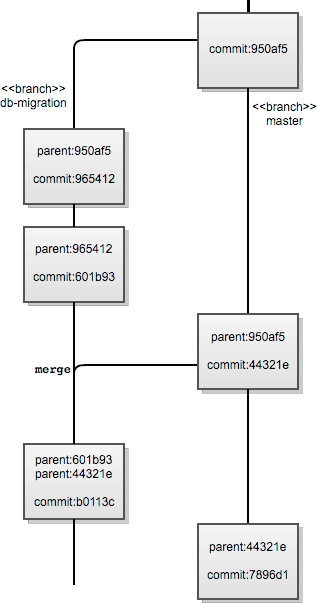

# Git

**수잔 포터 (Susan Potter)**

## 짧게 깃이란?

깃(Git)은 P2P 저장소 네트워크를 사용하여 여러사람이 협력하여 만드는 디지털
작업물(주로 코드이지만, 반드시 코드일 필요는 없음)을 관리한다. 깃은
임시로 나눠서 진행한 작업 내용을 나중에 합치는 식으로 분산 작업을 지원한다.

이 글은 이를 가능하도록 깃 내부의 여러 요소가 어떻게 동작하는지와
깃이 다른 버전관리시스템(VCS)과 어떻게 다른지 살펴본다.

## 깃의 기원

깃을 어떤 철학을 가지고 설계했는지 이해하기위해 리눅스 커널 공통체에서 깃
프로젝트를 시작했던 상황을 알아야 한다.

커미터가 많고 커미터 간에 참여도와 기존 코드를 이해하는 정도가 크게 차이가
나는 리눅스 커널은 당시 대부분의 상용 소프트웨어 프로젝트들과 비교하여
남달랐다. 커널은 여러해동안 tar파일과 패치파일로 유지되었고, 핵심 개발자들은
그들의 요구를 대부분 만족하는 VCS를 찾기위해 고심했다.

깃은 2005년 이런 요구와 불만에서 태어난 오픈소스 프로젝트이다. 당시
리눅스 커널 코드는 다른 핵심 개발자들이 두가지 VCS(BitKeeper와 CVS)로
관리했다. 비트키퍼(BitKeeper)는 당시 널리 쓰이던 오픈소스 VCS들과 다른 식으로
이력을 보여주었다.

비트키퍼의 제작사인 비트무버(BitMover)가 일부 핵심 리눅스 커널 개발자의
라이선스를 취소한다고 발표하고 몇일이 지난 후 리누스 토발즈(Linus Torvalds)는
훗날 깃이 될 것을 서둘러 개발하기 시작했다. 그는 이메일 패치를 연속해서
적용할 수 있도록 돕는 스크립트들을 작성하기 시작했다. 이 초기 스크립트들은
소스를 유지하는 사람이 패치들 사이에 손수 머지할 코드를 수정하고 계속해서
이후 패치를 머지할 수 있도록 빠르게 패치 충돌 여부를 파악하기위해 만들었다.

처음부터 토발즈는 안티CVS라는 깃의 철학적 목표와 아래 세가지 사용성
설계 목표를 세웠다.

* 비트키퍼와 유사한 분산 작업 지원
* 내용 변질을 방지하는 안전장치 제공
* 고성능

뒤에 나오겠지만 이 설계 목표는 어느정도 달성되고 지켜졌다. 나는 내용물을
저장하기위해 깃이 어떻게 방향성 비순환 그래프(DAG, directed acyclic graph)를
사용하는지와 헤드(head)를 참조하는 포인터, 객체 모델 표현, 원격 프로토콜을
설명하고, 마지막으로 깃이 트리 머지를 추적하는 방식을 다룬다.

깃의 최초 설계는 비트키퍼의 영향을 받았만, 깃은 근본적으로 다르게
구현되었고 더 분산된 작업은 물론이고 비트키퍼로는 불가한 단독(로컬) 작업도
가능하다. 2003년에 시작한 오픈소스 분산 VCS
[모노톤(Monotone)](http://www.monotone.ca/)도 깃의 초기 개발에 영향을
주었을 것이다.

분산 버전관리시스템을 사용하면 매우 유연한 작업이 가능하지만, 그 대가로
복잡해지기 마련이다. 분산 모델을 사용할 때 이점은 다음과 같다.

* 공동작업자가 오프라인으로 작업한 결과를 조금씩 커밋할 수 있다.
* 공동작업자가 자신의 작업을 공유할 시기를 결정할 수 있다.
* 오픈라인일 때도 공동작업자는 저장소 이력을 볼 수 있다.
* 관리한 작업물을, 서로 다른 브랜치와 변경 내용도 다르게, 여러 저장소에
  보낼 수 있다.

깃 프로젝트를 시작할 무렵 다른 오픈소스 분산 VCS 프로젝트 세개도 생겨났다.
(그중 하나가 《오픈소스 어플리케이션 아키텍처》 1권에서 다룬
머큐리얼(Mercurial)이다.) 이들 분산VCS (dVCS) 도구들은 서로 약간 다른
방식으로 기존 중앙관리식 VCS가 직접 다룰 수 없었던 매우 유연한 작업을
지원한다. 주: 서브버전(Subversion)에는, 다른 개발자들이 개발한,
서버간 동기화를 지원하는 SVK란 확장이 있다.

현재 활발하게 개발되고 있는 유명한 오픈소스 분산VCS 프로젝트는 바자(Bazaar),
닥스(Darcs), 파슬(Fossil), 깃, 머큐리얼(Mercurial), 버래서티(Veracity)가 있다.

## 버전관리시스템 설계

먼저 한발 뒤에서 깃 이외의 VCS들을 보자. 차이를 이해하면 깃을 설계하면서
어떤 선택을 했는지 알 수 있다.

버전관리시스템은 보통 다음 세가지 핵심 기능 요구사항이 있다.

* 내용 저장
* 내용 변화 추적 (머지 메타정보를 포함한 이력)
* 공동작업자들 간에 내용과 이력 분배

주: 세번째 요구사항은 모든 VCS의 기능 요구사항은 아니다.

### 내용 저장

VCS는 내용을 저장하는 방식으로 델타기반 변경집합(delta-based changeset)이나
방향성 비순환 그래프(DAG) 내용 표현을 선택한다.

델타기반 변경집합은 내용의 두 판 사이의 차이점에 메타정보를 조금 더한 것이다.
내용을 방향성 비순환 그래프로 표현하면, 커밋 시점의 스냅샷으로
파이시스템 트리를 본딴 객체 계층구조를 만든다 (트리에서 판 사이에 그대로인
객체는 가능한 재사용한다). 깃은 여러 종류의 객체를 사용한 방향성 비순환
그래프로 내용을 저장한다. 아래 "객체 데이터베이스" 절에서 깃 저장소 안에서
DAG를 구성하는 객체 종류들을 소개한다.

### 커밋과 머지 이력

이력과 변경추적을 위해 대부분의 VCS 소프트웨어는 아래 방법 중 하나를 사용한다.

* 선형 이력
* 이력을 위한 방향성 비순환 그래프

여기서도 깃은 자신의 이력을 저장하기위해 DAG를 사용한다. 커밋은 자신의 조상에
대한 메타정보를 포함한다. 깃에서 커밋은 부모 커밋이 없거나 (이론상 무제한)
여러 개일 수 있다. 예를 들어, 것 저장소의 첫번째 커밋은 부모가 없지만,
세방향 머지 결과로 생긴 커밋은 부모가 3개이다.

선형 이력을 사용하는 서브버전과 달리 깃은 브랜치를 직접 지원하고 대부분의
이력 머지 사례를 기록할 수 있다.

 그림 1: 깃에서 DAG 표현예

깃은 내용물을 저장하기위해 방향성 비순환 그래프를 사용하여 완전한 브랜치 기능을
제공한다. 파일 이력은 (디렉토리를 표현하는 노드를 통해) 디렉토리 구조를 따라
루트 디렉토리까지 쭉 연결되고, 루트 디렉토리는 커밋 노드와 연결된다. 또,
커밋 노드는 부모 노드를 여러개 가질 수 있다. 그래서 두가지 면에서 RCS에서
파생된 VCS들과 확실히 다르게 내용과 이력을 다룬다.

* 그래프에서 한 내용 (즉, 파일이나 디렉토리) 노드가 다른 커밋에서 동일한
  참조값(깃에서는 SHA)을 가진다면, 두 노드의 내용이 동일함이 보장된다.
  그래서 깃은 효율적으로 내용이 같은지 비교할 수 있다.
* 두 브랜치를 머지할 때 DAG에 있는 두 노드의 내용을 머지한다. DAG 때문에 깃은
  (RCS 계열 VCS에 비해) "효율적으로" 공동의 선조를 찾을 수 있다.

### 분배

VCS 소프트웨어들은 세가지 방법 중 하나를 사용하여 프로젝트 공동작업자들과
작업 중인 내용을 공유한다.

* 로컬 전용: 위의 세번째 기능 요구사항이 없는 VCS 소프트웨어들이 사용
* 중앙 서버: 저장소의 모든 변화는 모든 이력을 저장하는 특정한 한 저장소를 통해
  처리해야 한다
* 분산 모델: 보통은 공동작업자들이 "푸시할" 공개된 저장소가 있지만, 일단 로컬에
  커밋을 하고 나중에 공개 노드로 푸시하는 식으로 오프라인 작업이 가능하다.

설계 선택별 주된 장단점을 살펴보기위해 (서버에) 동일한 내용을 가진
서브버전 저장소와 깃 저장소가 있다고 가정하자 (즉, 깃 저장소 기본 브랜치의
HEAD가 서브버전 저장소 trunk의 최신 리비전과 동일한 내용이다). 개발자
알렉스는 서브버전 저장소를 로컬에 체크아웃(checkout)했고 깃 저장소를
로컬에 클론(clone)했다.

알렉스가 로컬 서브버전 체크아웃에 있는 1 MB 파일을 수정하고 변경을 커밋했다.
작업컴퓨터에 있는 파일의 체크아웃에 최신 변화가 반영되고 로컬 메타데이터는
갱신되었다. 알렉스가 중앙 서브버전 저장소에 커밋하는 동안 파일의 이전 스냅샷과
새로운 변화 사이의 차이(diff)를 만들어 저장소에 저장한다.

깃은 다르게 동작한다. 알렉스가 로컬 깃 클론에 있는 동일한 파일을 똑같이
수정하면, 변화는 우선 로컬에 기록된다. 알렉스가 로컬에 대기중인 커밋을
공개 저장소로 "푸시"한 이후에 프로젝트의 다른 공동작업자와 작업이 공유된다.
내용 변화는 커밋한 깃 저장소마다 동일하게 저장한다. (가장 간단한 경우)
로컬 커밋하면 로컬 깃 저장소는 수정된 파일마다 (파일 내용을 포함하여) 파일을
표현하는 객체를 새로 만든다. 수정된 파일 상위의 (저장소 루트 디렉토리를
포함한) 모든 디렉토리마다 새로운 지시자를 가진 트리 객체를 새로 만든다.
새로 만든 트리 루트 객체부터 시작하여, 이전 트리 계층구조에 있던 파일의 이전
블랍(blob) 객체 자리에 대신 새로 만든 블랍을 참조하는 DAG를 만들어 간다
(이번 커밋에서 파일 내용이 변경되지 않았다면 기존의 블랍 참조를 재사용한다).
(**블랍**은 저장소에 저장된 파일을 나타낸다.)

아직 커밋은 알렉스 컴퓨터 디스크의 아직 현재 깃 클론에만 있다. 알렉스가 커밋을
공개적으로 접근할 수 있는 깃 저장소로 "푸시"하면, 커밋을 저장소로 보낸다.
공개 저장소가 커밋을 브랜치에 적용할 수 있다고 확인한 이후, 원래 로컬 깃
저장소에 만들었던 객체가 똑같이 공개 저장소에도 저장된다.

로컬에서 커밋으로 변화를 추적하는 일과 원격 저장소와 변화를 공유하는 일을
분명히 구분하기위해 깃은 사용자에게 보이는 외부와 안보이는 내부 모두 복잡하다.
그러나 이런 복잡성은 "깃의 기원" 절에서 설명하였듯이 팀의 작업과 소프트웨어
새버전 발표를 훨씬 더 유연하게 만든다.

서브버전의 경우 공동작업자는 다른 사람들에게 변화를 보여주기위해 공개된
원격 저장소로 푸시할 필요가 없다. 큰 파일을 조금 수정하면 중앙 서브버전
저장소로 변경된 부분(델타)만 전송하면 되므로 버전마다 전체 파일내용을
저장하는 것보다 훨씬 효율적이다. 그러나 깃이 이런 경우를 피해가는 해결책이
있고, 뒤에서 소개하겠다.

## 툴킷

오늘날 깃은 (처음에는 거의 지원하지 않았던 윈도우즈를 포함하여) 다양한
운영체제에 여러 명령행 도구와 GUI 도구가 있다. 이 도구들 대부분은
깃 핵심 툴킷을 기반으로 만들었다.

처음에 리누스가 깃을 만들었고 리눅스 공동체에서 채택했기 때문에
툴킷 설계 원칙은 전통적인 유닉스 명령행 도구와 유사하다.

깃 툴킷은 배관과 도자기 두 부분으로 나뉜다. 배관(plumbing)은 기초적인 파일내용
추적과 방향성 비순환 그래프(DAG)를 조작하는 저수준 명령어로 구성된다.
도자기(porcelain)는 대부분의 일반 깃 사용자가 저장소를 관리하고 공동작업자
저장소들 사이의 통신을 위해 사용하는 적은 수의 `git` 명령어들이다.

스크립트 작성자들에게 세세한 기능을 제공하기에 충분한 명령어가 툴킷에 있지만,
어플리케이션 개발자들은 링크할 수 있는 깃 라이브러리를 요구했다. 깃 명령어가
`die()`를 호출하기 때문에 재진입할 수 없다. 그래서 GUI나 웹 인터페이스 혹은
오랫동안 실행하는 서비스는 깃 바이너리를 fork/exec할 수 밖에 없어서 느리다.

어플리케이션 개발자의 상황을 개선할 작업이 끝나간다. 자세한 내용은
"현재 작업과 향후 계획" 절을 참고하라.

## 저장소와 인덱스 그리고 작업영역

핵심 개념 몇가지를 이해하기위해 팔을 걷어붙이고 로컬에서 깃을 사용해보자.

먼저 아래와 같이 내가 사용하는 (유닉스 계열 운영체제를 가정) 컴퓨터 로컬
파일시스템에 초기화된 깃 저장소를 새로 만들자.

    $ mkdir testgit
    $ cd testgit
    $ git init

이제 testgit 디렉토리 안에 비었지만 초기화된 깃 저장소가 생겼다. 이 저장소를
브랜치하거나 커밋하거나 태그하거나 심지어 다른 로컬 혹은 원격 깃 저장소와
통신할 수 있다. 게다가 몇가지 `git` 명령어만 사용해서 다른 VCS 저장소와도
통신할 수 있다.

`git init` 명령어는 testgit 안에 .git 하위디렉토리를 만든다. 그 안을
들여다보자.

    tree .git/
    .git/
    |-- HEAD
    |-- config
    |-- description
    |-- hooks
    |   |-- applypatch-msg.sample
    |   |-- commit-msg.sample
    |   |-- post-commit.sample
    |   |-- post-receive.sample
    |   |-- post-update.sample
    |   |-- pre-applypatch.sample
    |   |-- pre-commit.sample
    |   |-- pre-rebase.sample
    |   |-- prepare-commit-msg.sample
    |   |-- update.sample
    |-- info
    |   |-- exclude
    |-- objects
    |   |-- info
    |   |-- pack
    |-- refs
        |-- heads
        |-- tags

설정 기본값은 루트 작업 디렉토리 `testgit`의 하위디렉토리로 `.git` 디렉토리를
만든다. 여기에는 여러 다른 종류의 파일과 디렉토리가 있다.

* **설정**: 기본적으로 `.git/config`, `.git/description`, `.git/info/exclude`
  파일은 로컬 저장소 설정을 돕는다.
* **훅(hook)**: `.git/hooks` 디렉토리에는 저장소에 어떤 사건이 발생할 때
  실행하는 스크립트들이 있다.
* **스테이징 공간(staging area)**: (위 트리 목록에는 아직 안보이는)
  `.git/index` 파일은 현재 작업 디렉토리의 스테이징 공간을 제공할 것이다.
* **객체 데이터베이스**: 기본 깃 객체 데이터베이스인 `.git/objects` 디렉토리는
  모든 파일내용 혹은 참조를 담는다. 모든 객체는 한번 생성하면 변경할 수 없다.
* **참조**: `.git/refs` 디렉토리는 로컬과 원격 브랜치/태그/헤드의 참조를
  저장하는 기본 장소이다. 참조는 객체를 가리키며 보통 `tag` 혹은 `commit`이다.
  저장소가 진화해가며 가리키는 대상이 변할 수 있기 때문에 참조는
  객체 데이터베이스 밖에서 관리한다. `HEAD`와 같이 다른 참조를 가리키는
  특수한 참조도 있다.

실제로 `.git` 디렉토리가 저장소이다. 작업하는 파일들이 있는 디렉토리를
작업 디렉토리라고 하며 보통은 `.git` 디렉토리(즉, 저장소)의 상위 디렉토리이다.
깃 원격 저장소는 작업 디렉토리가 필요없는데 `git init --bare` 명령어를 사용하여
저장소를 초기화한다. 이 명령어는 하위디렉토리에 저장소를 만드는 대신
단지 저장소 파일을 한 단계 올려서 루트에 만든다.

**깃 인덱스** `.git/index` 파일도 매우 중요하다. 이 파일은 로컬 작업 디렉토리와
로컬 저장소 사이의 스테이징 영역을 제공한다. 인덱스는 함께 커밋할 한
(혹은 여러) 파일의 특정 변화를 스테이징할 (묶어서 무대에 올릴) 때 사용한다.
다양한 기능을 작업하더라도 커밋 문구에 논리적인 설명을 달아 비슷한 변화를
함께 커밋할 수 있다. `git add -p` 를 사용하여 파일 한개나 여러 파일의
특정 변화를 선택적으로 스테이징할 수 있다.

기본적으로 깃 인덱스는 저장소 디렉토리 아래 한 파일에 저장한다. 이 세 영역의
경로는 환경변수로 조정할 수 있다.

몇가지 핵심 깃 명령어를 실행할 때 이 세 영역 (저장소와 인덱스 그리고 작업영역)
사이를 어떻게 이동하는지 이해하면 도움이 된다.

* `git checkout [브랜치]` 
  이 명령어는 로컬 저장소의 HEAD 참조를 (`refs/heads/master` 같이) 지시한
  브랜치 참조 경로로 이동하고, 인덱스를 이 헤드 정보로 채우고, 작업 디렉토리를
  이 헤드 트리에 맞게 복구한다. (즉, 지시한 브랜치에 맞게 인덱스와 작업영역을
  변경)
* `git add [파일들]` 
  지정한 **파일들**의 체크섬과 깃 인덱스의 해당 항목을 서로 비교하여 스테이징한
  파일의 인덱스를 작업 디렉토리에 있는 파일로 갱신해야 하는지 판단한다.
  깃 디렉토리(혹은 저장소)에는 아무 변화가 없다. (즉, 작업영역을 인덱스로 변환)

`.git` 디렉토리(혹은 저장소) 안에 있는 파일 내용을 보면서 이것이 무슨 의미인지
더 구체적으로 알아보자.

    $ GIT_DIR=$PWD/.git
    $ cat $GIT_DIR/HEAD
     
    ref: refs/heads/master
    
    $ MY_CURRENT_BRANCH=$(cat .git/HEAD | sed 's/ref: //g')
    $ cat $GIT_DIR/$MY_CURRENT_BRANCH

    cat: .git/refs/heads/master: No such file or directory

깃 저장소에 한번도 커밋을 안했다면 깃의 기본 브랜치 `master`를 제외하고
브랜치가 존재하지 않기 때문에 오류가 난다. 여기서는 기본 브랜치 master도
파일로 존재하지 않는다.

이제 커밋을 하면, 이 커밋 때문에 기본적으로 master 브랜치가 생긴다.
그럼 해보자 (이력과 문맥을 유지한 동일한 쉘에서 계속한다).

    $ git commit -m "Initial empty commit" --allow-empty
    $ git branch
    
    * master
    
    $ cat $GIT_DIR/$MY_CURRENT_BRANCH
    
    3bce5b130b17b7ce2f98d17b2998e32b1bc29d68
    
    $ git cat-file -p $(cat $GIT_DIR/$MY_CURRENT_BRANCH)

깃 객체 데이터베이스 속 파일내용 표현이 보인다.

## 객체 데이터베이스

 그림 2: 깃 객체

깃은 네가지 종류의 기본 객체가 있고, 로컬 저장소에 있는 모든 것은 이 네가지를
기초로 만든다. 객체 각각은 **종류**, **크기**, **내용** 속성을 가진다.
기본형은 아래와 같다.

* **트리**: 내용이 있는 디렉토리를 표현하며 다른 트리나 블랍으로 구성된다.
* **블랍(blob)**: 블랍은 저장소에 저장된 파일 하나를 나타낸다.
* **커밋**: 커밋은 해당 커밋의 최상위 디렉토리를 표현하는 트리와 함께
  부모 커밋과 표준 속성을 가리킨다.
* **태그**: 태그는 이름이 있고, 저장소 이력에서 태그가 표현하는 시점의
  커밋을 가리킨다.

모든 기본형 객체는 아래 속성을 가지는 40자리 객체 식별자 SHA로 참조한다.

* 두 객체가 동일하다면, 그들은 SHA가 동일하다.
* 두 객체가 다르다면, 그들은 SHA가 다르다.
* 객체가 일부만 복사되었거나 자료가 변질되면, 현재 객체의 SHA를 다시
  계산하여 변질 여부를 알아낸다.

객체의 신원과 관련된 앞의 두 SHA 속성은 (깃의 두번째 목표) 깃의 분산 모델을
만드는데 매우 유용하다. 마지막 속성은 (깃의 세번째 목표) 변질에 대한 몇가지
안전장치를 제공한다.

DAG 기반으로 내용을 저장하고 이력을 머지하는 장점에도 불구하고 느슨한
DAG 객체 보다는 바뀐 부분만 델타 저장하는 편이 보통 더 적은 공간을 차지한다.

## 저장과 압축 기법

깃은 압축된 형식으로 객체를 저장하고 해당 압축 파일에서 특정 객체의 위치를
가리키는 인덱스 파일을 사용하여 저장 공간 문제를 대응한다.

 그림 3: 압축 파일과 해당 인덱스 파일

`git count-objects` 명령어는 로컬 깃 저장소의 느슨한 (즉, 압축을 안한)
객체 개수를 센다. 필요하다면 깃 배관 명령어를 사용하여 객체 데이터베이스에
저장된 느슨한 객체를 압축하고, 이미 압축된 느슨한 객체를 삭제하며,
중복된 압축 파일(pack file)을 찾을 수 있다.

처음 버전은 압축 파일과 인덱스 파일의 CRC 체크섬을 인덱스 파일에 기록했고,
그후 깃의 압축 파일 형식은 진화했다. 처음 버전은 다시 압축할 (repacking) 때
체크섬을 검사하지 않기 때문에 압축된 자료가 변질되는 문제를 발견하지 못할
수 있었다. 압축 파일 버전 2는 압축 인덱스 파일 안에 압축한 객체마다
CRC 체크섬을 포함하여 이 문제를 해결했다. 또, 버전 2는 처음 버전이
지원하지 않았던 4 GB 보다 큰 압축 파일을 허용한다. 압축 파일 변질 여부를
빨리 확인할 수 있도록 압축 파일 마지막에는 그 파일에 있는 모든 SHA을
순서대로 합한 20바이트 SHA1 총합이 있다. 새로운 압축 파일 형식은 자료
변질을 방지하는 안전장치로서 깃의 두번째 사용성 설계 목표 달성을 돕는다.

깃이 원격통신할 때 저장소들을 (혹은 단지 브랜치 하나를) 동기화하기위해
네트워크로 전송할 커밋과 내용을 계산하고, 클라이언트가 바라는
프로토콜을 사용하여 전송할 압축 파일을 즉석에서 생성한다.

## 머지 이력

앞에서 말했듯이 깃은 머지 이력을 접근하는 방식이 RCS 계열 VCS들과 근본적으로
다르다. 예를 들어, 서브버전은 파일이나 트리의 이력을 선형으로 표현한다.
리비전 숫자가 높은 것은 무조건 이전 것을 대체한다. 브랜치를 직접 지원하지 않고,
저장소내 권장 디렉토리 구조를 활용하여 브랜치를 흉내낸다.

 그림 4: 머지 이력 계보

여러 작업 브랜치를 유지할 때 선형 방식이 어떻게 문제가 되는지 예를 들겠다.
그리고 이 방식의 한계를 보여주는 경우를 살펴보겠다.

서브버전에서 "브랜치" 작업시 보통 `branches/브랜치명`에서 한다. (보통
**master** 같이 중심이 되는 코드가 위치한) `trunk`와 동급 디렉토리의
하위트리에서 작업한다. 이 브랜치에서 `trunk` 트리와 병행으로 개발한다고
가정하자.

예를 들어, 다른 데이터베이스를 사용하도록 코드를 재작성할 수 있다. 재작성
작업 중에 (trunk가 아닌) 또 다른 브랜치 하위트리로부터 업스트림 변화를
머지하고 싶다. 필요하다면 수동으로 이 변화를 머지하고 계속 재작성을 진행했다.
시간이 지나서 `branches/브랜치명` 브랜치에 데이터베이스 이전 코드를 완료했고
이 변화를 `trunk`로 머지한다. 서브버전 같은 선형 이력 VCS는 다른 브랜치의
변경내용이 현재 trunk에 들어있는지 알 수 있는 방법이 없다.

깃 같은 DAG 기반 머지 이력 VCS은 이런 경우를 합리적으로 잘 처리한다.
다른 브랜치에 머지된 커밋이 모두 데이터베이스 이전 브랜치(즉, 우리 깃 저장소의
`db-migration`)에도 머지되었다면, 커밋 객체 부모 관계에서 `db-migration`
브랜치 커밋 중에 다른 업스트림 브랜치의 **끝**(즉, HEAD)이 있다.
커밋 객체는 부모를 여러개 (오직 머지하는 사람의 능력에 제한됨) 가질 수 있다.
그러므로 `db-migration` 브랜치에 있는 머지 커밋은 부모들의 SHA 해시를 보고
자신이 현재 브랜치의 현재 HEAD와 다른 업스트림 브랜치의 HEAD에 이미
머지되었는지 **안다**. 이는 (깃에서 `trunk`에 해당하는) `master`의
머지 커밋도 마찬가지다.

DAG 기반 (그리고 선형 기반) 머지 이력을 사용하여 각각의 브랜치에 어떤 커밋이
있는지 명확하게 답하기는 힘들다. 두 브랜치의 모든 변화를 서로 상대에게 머지하는
경우가 그렇다.

커밋을 브랜치에 깔끔하게 적용가능한 단순한 경우라면, 깃은
다른 브랜치의 커밋을 선별하여(cherry-pick) 현재 브랜치에 적용할 수 있다.

## 앞으로 미래

앞에서 말했듯이 우리가 오늘날 아는 깃 핵심은, 스크립트를 만들 때는 매우
편리하지만 오래 실행하는 어플리케이션이나 서비스 안에 내장하거나 함께
링크하기에는 덜 유용한, 유닉스 세계의 툴킷 설계 원칙을 따른다. 오늘날 여러
유명한 통합개발환경(IDE)이 깃을 지원하지만, 깃은 여러 플랫폼에서
사용할 수 있는 쉽게 링크하고 공유할 수 있는 라이브러리를 제공하는 VCS 보다
지원하고 유지하기 훨씬 어렵다.

이 문제를 바로잡으려고 (구글 오픈소스 프로그램 사무소의)
숀 피어스(Shawn Pearce)가 라이브러리 사용을 저해하지 않는 더 관대한
라이선스의 링크가능한 깃 라이브러리를 만드는 총대를 맺다. 이 라이브러리가
[libgit2](https://github.com/libgit2/libgit2)이다. 작년에
빈센트 마티(Vincent Marti)란 학생이 구글 여름 코드 프로젝트로 선택하기
전까지 별다른 진척이 없었다. 그 때부터 빈센트와 깃헙(Github) 기술자들이
libgit2 프로젝트에 계속 공헌하여 루비, 파이선, PHP, .NET 언어들, 루아,
오브젝티브-C 등 여러 인기있는 언어를 위한 바인딩을 만들었다.

숀 피어스는 또 깃 저장소의 여러 일반적인 명령을 지원하는 BSD 라이선스의
순수 자바 라이브러리 [JGit](https://github.com/eclipse/jgit)을 시작했다.
현재 이클립스 IDE 깃 통합에 사용하며 이클립스 제단에서 계속 개발을 담당한다.

깃 핵심 프로젝트 외에도 흥미롭고 실험적인 오픈소스 노력들 중에 아래와 같이
다른 깃 객체 데이터베이스 저장수단을 사용하는 구현들이 있다.

* [jgit_cassandra](https://github.com/spearce/jgit_cassandra) -
  다이나모(Dynamo)식 분산 저장과 빅테이블(BigTable) 칼럼 계열 저장 모델을
  혼합한 아파치 카산드라(Apache Cassandra)에 깃 객체를 저장한다.
* [jgit_hbase](https://github.com/spearce/jgit_hbase) - 분산 키-값 저장장소인
  HBase에 저장된 깃 객체를 읽고 기록할 수 있다.
* [libgit2-backends](https://github.com/libgit2/libgit2-backends) -
  Memcached, Redis, SQLite, MySQL 같은 다양한 대중적인 저장장소를
  깃 객체 데이터베이스로 사용하려고 시작한 libgit2 작업이다.

이 오픈소스 프로젝트는 모두 깃 핵심 프로젝트와 무관하게 유지된다.

이렇듯 요즘 매우 다양한 방법으로 깃 형식을 사용하고 있다. 깃의 얼굴은
더 이상 깃 핵심 프로젝트의 툴킷 명령행 인터페이스가 아니다. 그보다는
저장소 형식과 저장소간 공유 프로토콜이다.

이 글을 쓰는 당시 개발자들이 말하길 대부분의 프로젝트는 아직 안정화되지
못했고 많은 노력으로 개선할 부분이 있지만, 깃의 미래는 밝아 보인다.

## 배운 교훈

모든 소프트웨어 설계 결정은 궁극적으로 트레이드오프이다. 깃을 버전 관리에
사용하는 파워유저이자 깃 객체 데이터베이스 모델을 다루는 소프트웨어 개발자로서
나는 깃의 현재 모습을 정말 좋아한다. 그래서 배운 교훈이라기보다 깃의 설계
결정과 깃 핵심 개발자들의 우선순위 때문에 자주 반복되는 불만을 되돌아보겠다.

깃에 대한 개발자와 관리자의 가장 흔한 불만 중 하나는 다른 VCS 도구 수준의
IDE 통합이 부족한 점이다. 깃의 툴킷 설계 때문에 다른 현대적인 VCS 도구들 보다
IDE와 관련 도구를 연동하기 힘들다.

초창기에는 일부 명령어를 쉘스크립트로 작성했다. 이 쉘스크립트 명령어는 깃을,
특히 윈도우즈로, 포팅하기 힘들게 만들었다. 깃 핵심 개발자들이 이 사실을
까맣게 잊고 있지 않다고 확신하지만, 깃 개발 초창기 무렵에 만연한 포팅가능성
문제는 큰 조직의 깃 도입에 악영향을 주었다. 현재는 제때 새 깃 버전을
윈도우즈로 포팅하려고 사람들이 자발적으로 Git for Windows 프로젝트를 시작했다.

수많은 배관 명령어를 가진 툴킷 설계는 간접적으로 새로운 사용자를 빨리
달아나게 했다. 복잡하게 널려 있는 수많은 하위명령어에서부터 실패한 저수준
배관 명령의 이해할 수 없는 오류문까지 여러 곳에서 새로운 사용자는 길을 잃었다.
그래서 깃을 도입하기 힘들었던 개발팀도 있었다.

이런 깃에 대한 불만에서 불구하고, 나는 깃 핵심 프로젝트와 여기서 시작한
관련 오픈소스 프로젝트들의 앞으로 가능성을 보면 신이 난다.

이 글은 [크리에이티브 커먼즈 저작자표시 3.0](http://creativecommons.org/licenses/by/3.0/legalcode)
라이선스를 따른다. 자세한 내용은 라이선스의 전체 설명을 참고하라.

