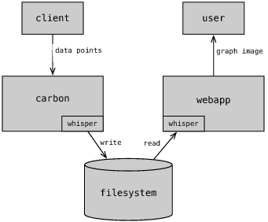
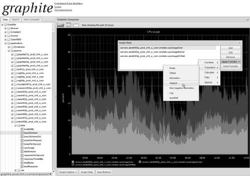

# Graphite

**크리스 데이비스 (Chris Davis)**

그래파이트(Graphite)[^1]는 시간에 따라 변하는 숫자를 저장하고 그래프로 그리는
두가지 매우 간단한 작업을 한다. 그동안 이런 기능을 하는 소프트웨어는 수없이
많았다. 그중 그래파이트의 강점은 사용하기 쉬우면서 확장이 용이한 네트워크
서비스를 제공하는 점이다. 그래파이트에 자료를 넣는 프로토콜은 너무 간단해서
몇분이면 직접 만들 수 있다 (실제로 직접 만들 필요는 없지만 그만큼 간단하다는
뜻이다.) 간단히 URL을 접근하여 그래프를 그리고 자료값을 얻을 수 있다. 다른
소프트웨어와 매우 자연스럽게 연동할 수 있고, 그래파이트를 기반으로 강력한
어플리케이션을 만들 수 있다. 모니터링과 분석을 위한 웹기반 대시보드에
그래파이트를 흔하게 사용한다. 그래파이트는 처음부터 대용량 상거래 환경을
고려하여 설계했다. 확장성과 실시간 자료 접근이 핵심 목표이다.

이 목표를 위해 그래파이트는 특별한 데이터베이스 라이브러리와 데이터베이스
저장형식 그리고 입출력 작업을 최적화하는 캐시 구조를 가지며 간단하지만
효율적으로 서버를 클러스터로 묶는다. 그래파이트가 현재 어떻게 동작하는지
설명하는 대신 처음에 어떻게 (상당히 간단하게) 구현했고 당면한 어떤 문제를
어떻게 해결했는지 보여주겠다.

## 데이터베이스 라이브러리: 시계열 자료 저장

그래파이트는 모두 파이썬으로 작성했고, 위스퍼(`whisper`)라는 데이터베이스
라이브러리와 카본(`carbon`)이라는 뒷단 데몬 그리고 그래프를 그리고 기본 사용자
인터페이스를 제공하는 앞단 웹프로그램, 이렇게 세가지 요소로 구성된다.
`whisper`는 그래파이트를 위해 만들었지만 따로 사용할 수 있다. 위스퍼는
RRDtool이 사용하는 라운드 로빈 데이터베이스와 구조가 매우 유사하고, 시계열
숫자값을 저장한다. 우리는 항상 데이터베이스를 클라이언트 어플리케이션이 소켓을
통해 통신하는 서버 프로세스로 생각하곤 한다. 그러나 `whisper`는 RRDtool과
마찬가지로 프로그램이 특별한 형식의 파일에서 저장된 자료를 조작하고
읽어오기위해 사용하는 데이터베이스 라이브러리이다. `whisper`의 가장 기본적인
작업은 신규 `whisper` 파일 생성(`create`), 파일에 새로운 자료값 갱신(`update`),
자료값 조회(`fetch`)이다.

{:.kd-center-align}

그림 1: `whisper` 파일의 기본 구조

그림 1에 보이듯 `whisper` 파일에는 여러 메타정보가 저장된 헤더부가 있고 그 뒤에
여러 저장부가 나온다. 아카이브는 `(시간, 값)` 쌍의 연속된 자료값의 순열이다.
`update`나 `fetch` 작업을 할 때 `whisper`는 시간과 저장 옵션에 따라 자료를
읽거나 기록할 파일내 위치를 판단한다.

## 뒷단: 간단한 저장 서비스

그래파이트의 뒷단은 `carbon-cache`라는 데몬 프로세스이고, 보통
카본(`carbon`)이라고 부른다. 매우 확장가능한 이벤트기반 파이썬 입출력
프레임워크 트위스티드(Twisted)를 사용했다. 트위스티드를 사용하여 `carbon`은
수많은 클라이언트와 효율적으로 통신하며 적은 부하로 많은 통신량을 처리할 수
있다. 그림 2는 `carbon`과 `whisper`와 앱프로그램 사이의 자료 흐름을 보여준다.
클라이언트 프로그램은 자료를 수집하여 그래파이트 뒷단으로 전송하고, `carbon`은
`whisper`를 사용하여 자료를 저장한다. 이후 그래파이트 웹프로그램이 이 자료를
사용하여 그래프를 만든다.

{:.kd-center-align}

그림 2: 자료 흐름

`carbon`은 기본적으로 클라이언트가 제공한 메트릭(metric)에 대한 자료값을
저장한다. 그래파이트 용어로, 메트릭은 (서버의 CPU 사용률이나 상품 판매량 같이)
시간에 따라 변할 수 있는 측정가능한 양이다. 자료값은 특정 시점에 특정 메트릭의
측정한 값을 나타내는 단순한 `(시간, 값)` 쌍이다. 메트릭은 이름으로 구별하고,
클라이언트 프로그램은 메트릭 이름과 자료값을 알려준다. 일반적으로 클라이언트
프로그램은 시스템이나 어플리케이션 메트릭을 수집하는 모니터링 에이전트이고,
손쉽게 저장하고 시각화하기위해 수집한 값을 `carbon`으로 전송한다. 그래파이트의
메트릭 이름은 단순한 계층구조를 따른다. 파일시스템과 비슷하지만 슬래시나
백슬래시 대신 마침표를 사용하여 단계를 구분한다. `carbon`은 받은 이름을 그대로
따르며 메트릭별로 자료값을 저장할 `whisper` 파일을 만든다. 메트릭 이름의
마침표로 구분한 계층구조에 따라 `carbon` 자료 디렉토리 아래 동일한 위치에
`whisper` 파일을 저장한다. 예를 들어, `servers.www01.cpuUsage`는 `…/servers/www01/cpuUsage.wsp`가 된다.

클라이언트 프로그램이 자료값을 그래파이트에 보내고 싶다면, 먼저 보통 2003[^2]
포트를 사용하는 `carbon`과 TCP 연결을 해야 한다. 통신에서 클라이언트는 보내기만
한다. `carbon`은 연결로 아무것도 보내지 않는다. 연결을 열어두거나 필요하면
재사용하면서 클라이언트는 간단한 평문 형식으로 자료값을 전송한다. 형식은
자료값마다 한 줄을 사용하고, 줄에는 마침표가 들어간 메트릭 이름과 숫자값과
유닉스 에폭 시간(epoch timestamp, 1970년 1월 1일 이후 지난 초)을 공백으로
구분하여 적는다. 예를 들면 클라이언트는 다음과 같이 전송한다.

	servers.www01.cpuUsage 42 1286269200
	products.snake-oil.salesPerMinute 123 1286269200
	[일분이 지나고]
	servers.www01.cpuUsageUser 44 1286269260
	products.snake-oil.salesPerMinute 119 1286269260

크게 보면 `carbon`이 하는 일은 이런 형식의 자료를 기다리고 `whisper`를
사용하여 가능한 빨리 디스크에 기록하는게 전부이다. 뒤에서 전형적인
하드디스크에서 확장성으로 보장하고 성능을 최대화하는 몇가지 기법을
자세히 다루겠다.

## 앞단: 주문형 그래프

그래파이트 웹프로그램는 사용자가 다양한 그래프를 요청할 수 있는 간단한 URL로
된 API를 제공한다. HTTP GET 요청의 질의문자열(query-string)에 그래프 파라미터를
적으면, 응답으로 PNG 그림을 준다. 예를 들어, 다음 URL은

	http://graphite.example.com/render?target=servers.www01.cpuUsage&
	width=500&height=300&from=-24h

지난 24시간 동안 `servers.www01.cpuUsage` 메트릭을 그린 500x300 그래프를
요청한다. 사실 target 파라미터만 필수이고, 다른 파라미터는 모두 선택적이다.
파라미터를 생략하면 기본값을 사용한다.

그래파이트는 간단한 함수 형태의 다양한 표시 옵션과 자료 처리 함수를 제공한다.
예를 들어, 이전 예제를 폭이 자료 10개인 이동평균으로 그리면 다음과 같다.

	target=movingAverage(servers.www01.cpuUsage,10)

함수 안에 함수를 사용한 복잡한 표현과 계산이 가능하다.

다음은 제품별 분당 판매량 메트릭을 사용하여 하루동안 누적 판매량을 그리는
예제이다.

	target=integral(sumSeries(products.*.salesPerMinute))&amp;from=midnight

`sumSeries` 함수는 `products.*.salesPerMinute` 패턴에 대응하는 모든 메트릭의
합을 시간 단위로 계산한다. `integral`은 분당 횟수 대신 누적합계를 계산한다.
그래프를 보고 조작하는 웹 사용자 인터페이스를 머리에 떠올릴 수 있다.
그래파이트에는 그림 3에 보이는 자체 편집 사용자 인터페이스가 들어있다.
사용자가 기능 메뉴를 클릭하면 자바스크립트로 그래프 URL 파라미터를 변경하는
식으로 동작한다.

{:.kd-center-align}

그림 3: 그래파이트의 편집(Composer) 인터페이스

## 대시보드

초창기부터 그래파이트는 웹기반 대시보드를 만드는 도구로 사용되었다. URL API
때문에 이런 용도는 자연스러웠다. 아래과 같은 태그로 가득한 HTML 페이지를
만들기만 하면 대시보드가 된다.

	

그러나 모두가 손으로 URL을 쓰기 좋아하지는 않는다. 그래서 그래파이트 편집
사용자 인터페이스가 생겼다. 마우스를 사용하여 그래프를 만들고 간단히 URL을
복사하여 붙여넣으면 된다. 웹페이지를 빠르게 만들 수 있는 (위키 같은) 다른
도구와 결합하면, 기술자가 아니여도 매우 쉽게 자신의 대시보드를 만들 수 있다.

## 명백한 병목점

사용자가 대시보드를 만들기 시작하자마자 그래파이트의 성능 문제가 터지기
시작했다. 왜 요청이 느려지는지 알아보기위해 웹서버 로그를 살펴보았다.
딱 보기에도 그래프 요청이 너무 많아서 문제가 되었다. 웹프로그램은 계속 그래프를
그리기위해 CPU를 많이 사용한다. 여러번 반복되는 동일한 요청이 보이고,
대시보드가 느려졌다.

그래프가 10개 있는 대시보드를 일분에 한번씩 갱신한다고 가정하자. 사용자가
브라우저에서 대시보드를 열면 그래파이트는 분당 10번 이상 요청을 처리해야 한다.
부하가 빠르게 증가한다.

간단한 해결책은 그래프를 한번만 그리고 사용자들에게 복사본을 서비스하는 것이다.
(그래파이트가 기반으로 사용하는) 장고(Django) 웹 프레임워크는 memcached 같은
다양한 뒷단을 선택할 수 있는 훌륭한 캐시 기능을 제공한다. Memcached[^3]는
기본적으로 네트워크 서비스 형태로 제공되는 해시테이블이다. 클라이언트
프로그램은 평범한 해시테이블처럼 키-값 쌍을 읽고 쓸 수 있다. Memcached를
사용하면 (그래프 그리기 같은) 비용이 많이 드는 요청의 결과를 매우 빨리 저장하고
나중에 요청을 처리할 때 가져올 수 있어서 장점이다. 항상 오래된 그래프를 계속
반환하지 않도록 시간이 조금 지나면 캐시한 그래프를 버리도록 memcached를 설정할
수 있다. 요청이 너무 흔하게 중복되기 때문에 비록 몇초일지라도 부담이 준다.

그리기 요청이 매우 많아지는 다른 경우는 사용자가 편집 사용자 인터페이스에서
표시 선택사항과 함수를 이리저리 변경할 때이다. 사용자가 뭔가를 변경할 때마다
그래파이트는 그래프를 새로 그려야 한다. 요청들이 동일한 자료를 사용하기 때문에
필요한 자료도 memcache에 두면 이득이다. 자료를 가져오는 단계를 건너뛰기 때문에
응답이 빨라진다.

## 입출력 최적화

그래파이트 서버로 6만개 메트릭을 일분에 한번씩 보낸다고 가정하자. 파일시스템에는
메트릭마다 `whisper` 파일이 한개씩 있다고 했다. 즉, `carbon`은 매분마다 6만개
파일에 쓰기 동작을 해야 한다는 뜻이다. 만약 `carbon`이 1밀리초마다 파일 하나를
기록한다면 따라잡을 수 있다. 이런 경우는 현실에서 충분히 가능하다. 이제
매분마다 60만개 메트릭이 갱신되거나 매초마다 변하는 메트릭이 있거나 저장장치가
느린 상황을 가정하자. 어떤 경우이든 자료값이 들어오는 속도가 저장장치가 견디는
쓰기 동작 속도를 넘어선다. 어떻게 이 상황을 처리해야 할까?

다른 두 위치에서 입출력 작업을 할때 둘 사이 시간을 탐색시간(seek
time)[^4]이라고 한다. 요즘 대부분의 하드디스크는 연속해서 자료를 쓸 때와
비교하여 탐색시간이 느리다. 즉, 연속해서 쓰기를 할 수록 단위시간당 처리량이
많아진다. 그러나 기록할 분량은 매우 작지만 (`whisper` 자료값 하나는 12바이트
밖에 안한다) 빈번히 기록할 파일이 수천개가 있다면, 디스크는 탐색하는데
시간을 대부분 보낼 것이다.

쓰기 작업의 최고 속도가 상대적으로 느리다는 가정하에 자료값 쓰기 속도를 높이는
유일한 방법은 한번 쓸 때 여러 자료값을 기록하는 것이다. `whisper`가 연속된
자료값을 디스크에 차례로 위치하기 때문에 이 방법이 가능하다. 그래서 나는
`whisper`에 `update_many` 함수를 추가했다. 이 함수는 한 메트릭의 자료값 목록을
받고, 연속된 자료값을 한번에 묶어서 기록한다. 한번에 기록하는 분량은
많아지지만, 자료값 10개(120바이트)를 쓰는 시간과 자료값 1개(12바이트)를 쓰는
시간의 차이는 미미하다. 상당히 더 많은 자료값을 기록해야만 지연시간이 눈에 띄게
느려지기 시작한다.

다음으로 나는 `carbon`에 버퍼링 기능을 구현했다. 자료값이 들어오면 메트릭
이름을 딴 대기열 뒤에 자료값을 추가한다. 다른 스레드는 계속해서 대기열들을
돌아가며 대기열에서 자료값을 모두 꺼내고 `update_many`로 해당 `whisper` 파일에
기록한다. 매분마다 60만 메트릭이 갱신되고 저장장치는 1밀리초마다 한번 쓰기가
가능한 앞의 예제로 되돌아가면, 대기열은 평균적으로 10개 정도 자료값을 담게 된다.
자료값이 몇바이트 밖에 안하기 때문에 상대적으로 여유가 있는 메모리 자원만
사용할 뿐이다.

이 전략은 저장장치의 최대 입출력 속도를 넘어서는 자료값 입력 속도를 견디기위해
자료값을 필요한 만큼 버퍼링하는 것이다. 또한 이 방식은 일시적인 입출력 지연을
탄력있게 처리하는 장점도 있다. 시스템이 그래파이트 이외에 다른 입출력 작업을
할 때 쓰기 작업 속도가 떨어질 수 있다. 이 경우 `carbon`은 대기열을 늘리면 된다.
대기열이 커지면 기록할 분량이 증가한다. 단위시간당 전체 자료값 처리량은 쓰기
작업 속도와 기록할 평균 분량의 곱이기 때문에 대기열을 위한 메모리만 충분한다면
`carbon`은 문제없다. 그림 4는 `carbon`의 대기열 방식을 보여준다.

{:.kd-center-align}

그림 4: 카본의 대기열 방식

## 실시간성

자료값을 버퍼링하면 `carbon` 입출력이 최적화되여 좋지만, 곧 사용자를 괴롭히는
부작용이 나타난다. 매분마다 60만개 메트릭을 갱신하는 앞의 경우로 되돌아가자.
저장장치는 분당 6만번 쓰기 작업까지만 가능하다고 했다. 즉, 평균적으로 10분
분량의 자료가 `carbon` 대기열에서 쉬고있다는 말이다. 사용자가 그래파이트
웹프로그램에 그래프를 요청했는데 최근 10분 자료가 없다면 문제다!

다행히도 해결책은 상당히 직관적이다. `carbon` 버퍼에 저장된 자료값을 조회할
수 있는 소켓 서버를 추가하고, 그래파이트 웹프로그램이 자료를 가져올 때마다
이 인터페이스를 사용하도록 간단히 수정했다. 웹프로그램이 `carbon`에서 가져온
자료값과 디스크에서 읽어온 자료값을 이어붙이면, 실시간 그래프가 된다. 물론
예제는 분단위로 자료값을 갱신하기 때문에 엄밀하게 말해서 "실시간"은 아니지만,
`carbon`이 입력으로 받은 자료값을 즉시 그래프로 보여준다는 면에서 실시간이다.

## 커널과 캐시 그리고 끔찍한 장애

그래파이트 자체 성능이 결정적으로 입출력 지연시간에 달렸다는 사실이 이제
명확해졌다. 지금까지 우리는 쓰기마다 일관되게 1밀리초 정도의 낮은 입출력
지연시간을 가정했지만, 더 자세히 살펴볼 필요가 있다. 우선 대부분의 하드디스크는
그렇게 빠르지 않다. 심지어 RAID로 여러 디스크를 묶어도 무작위 접근에 거의
대부분 1밀리초 이상 지연시간이 걸린다. 그러나 킬로바이트를 디스크에 기록할 때
걸리는 시간을 테스트해보면 심지어 오래된 노트북에서도 1밀리초 보다 훨씬 짧은
시간 안에 쓰기(write) 시스템호출이 반환한다. 왜 그럴까?

소프트웨어가 일관되지 않거나 예기치 못한 성능을 보이는 경우 항상 버퍼링이나
캐싱이 주범이다. 여기서는 둘을 모두 상대해야 한다. 쓰기 시스템호출은 사실
자료를 디스크에 기록하지 않는다. 단지 자료를 버퍼에 넣어두고, 나중에 커널이
디스크에 기록한다. 그래서 쓰기 호출이 항상 그렇게 빨리 반환하는 것이다.
버퍼를 디스크에 기록한 후에도 다음번 읽을 때 사용하기위해 캐시에 자료를
남겨두는 경우가 흔하다. 버퍼링과 캐싱을 하려면 물론 메모리가 필요하다.

똑똑한 커널 개발자들은 정확히 필요한만큼만 메모리를 할당하지 않고 현재 여유가
있는 사용자공간 메모리를 사용하면 좋다고 생각했다. 이 발상은 엄청난 성능 향상을
가져왔고, 시스템에 메모리를 아무로 더해도 입출력을 어느정도 한 이후에
"여유(free)" 메모리가 거의 항상 0이 되는 이유이기도 하다. 사용자공간
어플리케이션이 그 메모리를 사용하고 있지 않다면, 아마도 커널이 사용하고 있을
것이다. 이 방식의 단점은 사용자공간 어플리케이션이 자신을 위해 메모리를 더
할당해야 하는 시점에 커널이 "여유" 메모리를 모두 차지한 경우이다. 커널은
메모리를 돌려줄 수밖에 없고, 그곳에 저장된 버퍼는 사라진다.

이런 사실이 그래파이트에게 무슨 의미인가? `carbon`은 항상 입출력 지연시간이
느린 환경에 놓여있고, 쓰기 시스템호출은 자료를 버퍼에 복사만 하기 때문에
빨리 반환한다고 말했다. 커널에게 기록할 내용을 버퍼링하기에 충분한 메모리가
없다면 무슨 일이 일어날까? 쓰기가 동기화되어 상당히 느려진다! `carbon` 쓰기
명령 속도가 급격하게 떨어져서 `carbon`의 대기열이 커지고, 그래서 메모리를
더 잡아먹게 되어 커널은 한층 더 굼주리게 된다. 결국 이런 상황은 메모리가
부족해지거나 성난 시스템 관리자가 `carbon`을 죽이면서 끝난다.

이런 재앙을 피하기위해 나는 `carbon`에 대기열에 담을 수 있는 최대 자료값 개수와
일정 시간 동안 가능한 최대 `whisper` 명령 개수 등 한계값 설정 등 여러 기능을
더했다. 일부 자료값을 버리거나 자료값을 더 받지 못하는 약간의 악영향이 있지만,
`carbon`이 추락하는 사태를 막는다. 그러나 적절한 설정값은 시스템마다 다르고
오랜 시간동안 테스트하며 조절해야 한다. 도움이 되지만 근본적으로 문제를
해결하지는 않는다. 그렇기 때문에 하드웨어가 더 필요하다.

## 클러스터링

사용자 입장에서 최소한 기본 구성이라면 여러 그래파이트 서버를 한 시스템처럼
보여주는 것이 엄청나게 어렵지는 않다. 사용자는 기본적으로 지표를 찾고 (항상
그래프 형식으로) 자료값을 가져오는 두가지 명령을 통해 웹프로그램을 사용한다.
웹프로그램의 지표찾기(find)와 자료가져오기(fetch) 작업은 라이브러리 형식으로
나머지 코드와 구분했고, 원격에서 쉽게 호출할 수 있도록 HTTP 요청 처리자와
연결했다.

`find` 작업은 특정 확장자의 파일을 찾는 `*.txt` 같은 사용자가 입력한
패턴에 해당하는 `whisper` 파일을 파일시스템에서 찾는다. 결과는 `Node(노드)`
객체들의 트리 구조이고, 각각의 객체는 `Node`의 하위객체인 `Branch(가지)`와
`Leaf(잎)` 중에 하나이다. 디렉토리는 가지 노드이고, `whisper` 파일들은 잎
노드에 해당한다. 이렇게 추상화하면, RRD 파일[^5]과 gzip 압축한 `whisper`
파일 등 다양한 저장 형식을 지원하게 편하다.

`Leaf`는 잎의 종류에 따른 `fetch` 함수를 정의한다. `whisper` 파일이라면
`whisper` 라이브러리의 자료가져오기 함수를 약간 감싼 모습이다. 클러스터 지원을
추가하면, `find` 함수가 HTTP를 통해 웹프로그램 설정에 지시한 다른 그래파이트
서버로 지표찾기 원격호출을 하도록 확장된다. HTTP 호출 결과인 노드 자료를
평범한 `Node`, `Branch`, `Leaf` 구조를 따르는 `RemoteNode` 객체가 감싼다.
그래서 웹프로그램의 나머지 코드는 클러스터링 여부와 관계없이 동일하다.
원격 잎 노드 `fetch` 함수도 찾은 노드의 그래파이트 서버에서 자료값을 읽어오는
또 다른 HTTP 호출을 사용한다.

웹프로그램간 호출은 클라이언트 호출과 동일하지만, 명령을 클러스터로 분산하지
말고 직접 처리하라고 지시하는 파라미터가 하나 추가된다. 그래프를 그리라고
웹프로그램에게 요청하면, 웹프로그램은 `find` 명령으로 요청한 지표의 위치를
찾고 각각에 `fetch` 호출을 보내서 자료값을 얻는다. 자료가 현재 서버에
있거나 원격 서버에 있거나 둘 다이거나 관계없이 동일하게 동작한다. 서버가
죽으면, 원격 호출의 응답 대기시간이 금세 지나고 잠시동안 서버를
서비스불능으로 표시하여 다음에는 그 서버를 호출하지 않는다. 죽은 서버에 있는
자료가 다른 클러스터 서버에 복제되지 않았다면 사용자 입장에서 그래프에 나오지
않는다.

### 짧은 클러스터링 효율성 분석

그래프 요청에서 그래프를 그리는 부분이 가장 자원을 많이 사용한다. 서버가
그래프를 그리기 때문에 서버를 추가하면 실제로 그래프를 그리는 양이 증가한다.
그러나 결국 여러 요청이 클러스터에 있는 다른 서버로 `find` 호출을 하기 때문에
이런 클러스터 방식은 앞단의 부하를 분산하기 보다는 부하를 상당부분 공유하게
된다. 우리는 각각의 `carbon`이 독립적으로 동작할 수 있게 만들어서 뒷단 부하를
효율적으로 분산시켰다. 대부분의 경우 앞단 보다 뒷단이 훨씬 더 큰 명목점이기
때문에 좋은 출발이지만, 확실히 이 방법으로는 앞단이 수평확장하지 않는다.

앞단을 더 효율적으로 확장하려면 웹프로그램의 원격 `find` 호출 개수를 줄여야
한다. 여기서도 가장 쉬운 방법이 캐시이다. 이미 자료값과 그래프를 캐시하려고
사용한 memcached를 `find` 요청의 결과를 캐시하는데 사용할 수 있다. 지표를
저장한 위치가 덜 자주 변하기 때문에 오랫동안 캐시할 수 있다. 그러나 `find`
결과의 캐시 유효기간을 너무 길게 잡으면, 사용자에게 계층구조에 추가된 새로운
지표를 신속하게 보여주지 못할 수 있으니 균형이 필요하다.

### 클러스터 내 지표 분산

각 서버가 완전히 동일한 작업을 하기 때문에 클러스터의 그래파이트 웹프로그램들은
서로 비슷한 편이다. 그러나 `carbon`의 역할은 어떤 자료를 어떤 인스턴스로
보낼지에 따라 서버마다 차이가 난다. 보통 `carbon`에게 자료를 보내는
클라이언트가 많고 다양하기 때문에 모든 클라이언트에 그래파이트 클러스터 구조를
설정하기가 상당히 번거롭다. 비즈니스 지표는 중복저장을 위해 여러 `carbon`
서버로 보내지만, 어플리케이션 지표는 한 `carbon` 서버로 보낼 수 있다.

이런 경우 관리가 편하도록 그래파이트에 `carbon-relay`란 도구가 들어있다. 하는
일은 단순하다. (실제 `carbon-cache`란 이름의) 표준 `carbon` 서버와 마찬가지로
클라이언트에게 지표를 받지만, 자료를 저장하는 대신 지표 이름에 적용된 규칙에
따라 어떤 `carbon-cache` 서버로 중계할지 결정한다. 규칙에는 정규표현식과 대상
서버 목록이 들어간다. 자료값을 받을 때마다 순서대로 규칙을 적용하여 지표 이름이
정규표현식에 맞는 첫번째 규칙을 사용한다. 이제 모든 클라이언트는 자료를
`carbon-relay`에게 보내면 된다. 자료는 결국 올바른 서버에 도착한다.

어떤 면에서 `carbon-relay`는 복제 기능을 제공하지만, 동기화 문제를 다루지 않기
때문에 정확히는 입력 이중화라고 부른다. 서버가 일시적으로 죽으면 그 기간동안
자료값이 사라진다. 시스템 관리자가 직접 다시 동기화할 수 있는 관리스크립트가
있다.

## 설계를 되돌아보며

그래파이트 작업을 하며 확장성은 저수준 성능이 아니라 전체적인 설계의 산물이라는
믿음을 재확인할 수 있었다. 개발 과정에서 여러 병목점을 만났지만 매번 성능 향상
보다는 설계를 향상할 방법을 찾았다. 나 자신에게 왜 자바나 C가 아니라 파이썬으로
그래파이트를 작성하는지 여러번 자문했고, 그때마다 아직 다른 언어에서 가능한
성능이 진정으로 필요하지 않다고 답을 했다.
&#91;[Knu74](bib1.html#bib:knuth:goto)&#93;에서 도널드 커누스는 섣부른 최적화가
모든 악의 근원이라는 명언을 했다. 앞으로 코드가 사소하지 않게 계속 진화할
것이라고 가정하는 한 모든 최적화는[^6] 어떤 의미에서 섣부르다.

그래파이트의 가장 큰 장점이자 단점은 전통적인 의미에서 "설계되지" 않았다는
사실이다. 대체로 그래파이트는 난관을 만날 때마다 하나씩 극복하며 천천히
진화했다. 많은 경우 난관은 예상가능했고, 미리 자연스럽게 여러가지 방법으로
해결했다. 곧 발생할 것 같을지라도 아직 실제로 발생하지 않은 문제는 그대로 두는
편이 좋을 수 있다. 우월한 전략이론을 세우기 보다 실패를 가까이에서 실제로
살펴보면 배울게 훨씬 더 많기 때문이다. 경험적 자료와 우리의 지식과 직관을
동원하여 문제를 해결해 나갔다. 지혜가 의심되면 경험적 자료를 더 철저하게
살펴보게 된다.

예를 들어 내가 처음 `whisper`를 만들 때 파이썬 구현은 견본일 뿐이고 속도 때문에
C로 다시 작성해야 한다고 확신했다. 만약 내가 시간이 많았다면 파이썬 구현을
완전히 건너뛰었을 것이다. 그러나 CPU 보다 훨씬 먼저 입출력이 병목이 되었고,
덜 효율적인 파이썬은 실제로 전혀 문제가 안되었다.

그러나 앞서 말했듯이 진화적 접근방식은 그래파이트의 큰 약점이기도 하다.
인터페이스는 점진적 진화에 어울리지 않았다. 좋은 인터페이스는 예측가능성을
최대화하려고 일관된 관습을 택한다. 이런 면에서 현재 그래파이트 URL API는
수준 이하라고 생각한다. 옵션과 함수가 계속 덕지덕지 추가되어 군소적으로
일관성을 보일지라도 전체적인 일관성은 없다. 이런 문제의 유일한 해결책은
인터페이스를 버전별로 나누는 것이지만, 이 방법도 단점이 있다. 새로운
인터페이스를 설계해도 여전히 이전 인터페이스를 제거하기 힘들고 맹장처럼 진화의
앙금으로 남게 된다. 코드가 맹장염이 걸려서 (즉, 예전 인터페이스의 버그)
수술하기 전까지는 정상으로 보일 수 있다. 다시 처음으로 돌아간다면, 외부 API
설계를 하나씩 변경하기 보다는 미리 훨씬 더 고민할 것이다.

그래파이트의 다른 불편한 점은 덜 유연한 지표 이름 계층구조이다. 대부분의 경우
상당히 간단하고 매우 편리하지만, 일부 복잡한 질의를 표현하기 너무 힘들고
불가능할 때도 있다. 그래파이트를 만들 생각을 했을 때부터 나는 사람이 읽을
수 있는 그래프 URL API를 원했다[^7]. 지금도 이점은 바람직하게 보지만, 이런
요구사항 때문에 복잡한 표현이 불편한 매우 간단한 API 문법을 강제하지 않았나
생각한다. 경로가 기본적으로 트리에 있는 노드의 기본키(primary key)이기 때문에
계층구조를 사용하면 지표의 "기본키"를 파악하기 매우 쉽다. 열의 자료와 같은
모든 설명 자료가 경로 안에 직접 들어가는 점이 단점이다. 이 문제는 계층구조를
유지하면서 더 고차원 지표 선택이 가능하도록 특수한 문법으로 별도의 메타정보
데이터베이스를 추가하여 해결할 수 있다.

## 오픈소스 만들기

그래파이트 개발과정을 되돌아볼 때마다 프로젝트가 얼마나 멀리 왔으며
프로그래머로서 내가 얼마나 발전했는지 놀란다. 그래파이트는 몇백줄의 장난감
프로젝트로 시작했다. 그래프 그리기 엔진은 이것을 내가 만들 수 있나 알아보기위한
실험이였다. `whisper`는 중요한 개시날을 앞두고 해결안되는 문제로 고민하던
주말동안 작성했다. `carbon`은 기억할 수 없이 많이 다시 만들었다. 2008년
그래파이프를 오픈소스 라이선스로 공개할 수 있게 허락을 받았을 당시 이런 반응을
전혀 예상하지 못했다. 몇달 후 그래파이트를 언급한 CNET 기사가 Slashdot에
올라갔고, 프로젝트는 갑자기 떠서 지금까지 현역이다. 현재 여러 중대형 회사가
그래파이트를 사용한다. 공동체도 상당히 왕성하고 계속 커왔다. 완성된 제품이
아니기에 실험적인 수많은 멋진 작업들이 잠재력을 끌어내고 재미있게 개발을
계속하게 해주었다.

## 주석

[^1]: `http://launchpad.net/graphite`
[^2]: 평범한 텍스트 형식 보다 더 효율적인 질렬화한 객체를 받을 수 있는 포트가
    더 있다. 매우 전송량이 많은 경우에만 필요하다.

[^3]: `http://memcached.org`
[^4]: SSD는 일반 하드디스크에 비해 탐색시간이 매우 빠르다.
[^5]: 실제 가지 노드는 여러 자료원을 포함할 수 있는 RRD 파일이다. RRD 자료원이
    잎 노드가 된다.

[^6]: 커누스는 설계 개선 같은 거시적 최적화가 아닌 저수준 코드 최적화를 말했다.
[^7]: 그래프 자체가 오픈소스가 된다. 누구나 그래프 URL을 이해하고 수정할
    수 있다.

