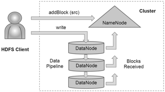
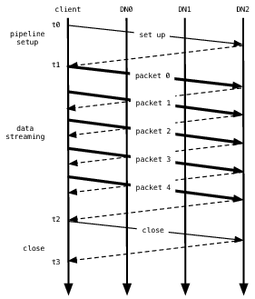

# The Hadoop Distributed File System

**로버트 챈슬러(Robert Chansler), 해롱 쾅(Hairong Kuang), 산제이 라디아(Sanjay
Radia, 콘스탄틴 쉬바츠코(Konstantin Shvachko), 수레쉬 스리니바스(Suresh
Srinivas)**

하둡 분산 파일시스템(HDFS, Hadoop Distributed File System)은 매우 큰 자료들을
안정적으로 저장하고, 이 자료를 사용자 어플리케이션에게 넓은 대역폭으로
전송하도록 설계되었다. 대형 클러스터에서 수천대 서버가 자체 저장 공간을
가지며 동시에 사용자 어플리케이션 작업을 실행한다. 저장과 계산을 여러 서버에
나누어 필요에 따라 경제적으로 자원을 키울 수 있다. 우리는 HDFS 아키텍처와
야후에서 40 페타바이트 기업 정보를 처리한 HDFS 경험담을 전한다.

## 소개

하둡[^1]은 분산 파일시스템과 MapReduce[[DG04](../bib1.html#bib:dean:mapreduce)]
패러다임을 활용하여 매우 커다란 자료를 분석하고 변환하기위한 프레임워크를
제공한다. HDFS 인터페이스는 유닉스 파일시스템을 본땄지만, 어플리케이션 성능을
높이기위해 표준을 일부 충실히 따르지 않았다.

하둡의 중요한 특징은 자료와 계산을 여러 (수천대의) 호스트로 나누고 병렬로
자료에 가까이 어플리케이션 계산을 실행하는 점이다. 단순히 평범한 서버를
추가하여 하둡 클러스터는 계산 능력과 저장 공간과 입출력 대역폭을 확장한다.
야후의 하둡 클러스터는 서버 4만대와 어플리케이션 자료 40 페타바이트를 망라하며
가장 큰 클러스터에는 서버 4천대가 있다. 전세계 백여개 단체에서 하둡을
사용한다고 한다.

HDFS는 파일시스템 메타정보와 어플리케이션 자료를 따로 저장한다. PVFS
[[CIRT00](../bib1.html#bib:carns:pvfs)], Lustre[^2], GFS
[[GGL03](../bib1.html#bib:ghemawat:gfs,bib:mckusick:gfs)] 같은 분산
파일시스템처럼 HDFS는 메타정보를 네임노드(NameNode)라는 전용 서버에 저장한다.
어플리케이션 자료는 데이터노드(DataNode)라는 다른 서버에 저장한다. 모든
서버는 서로 완전히 연결되있고, TCP 기반 프로토콜을 사용하여 통신한다.
Lustre나 PVFS와 다르게 HDFS의 데이터노드는 자료를 지키기위해 RAID 같은
자료 보호 수단을 사용하지 않는다. 대신 안정성을 위해 GFS처럼 파일 내용을
여러 데이터노드에 복제한다. 이 전략은 자료 보존 외에 자료 전송 배역폭을
늘리고 계산을 필요한 자료 근처에서 수행할 가능성이 커지는 장점이 있다.

## 아키텍처

### 네임노드

HDFS 네임스페이스는 파일과 디렉토리의 계층구조이다. 네임노드는
아이노드(inode)로 파일과 디렉토리를 표현한다. 아이노드는 권한, 수정일시,
접근일시, 네임스페이스, 디스크 공간 한도같은 속성을 기록한다. 파일 내용을
큰 블록으로 나누고 (보통 128 메가바이트 단위이지만 사용자가 파일별로
설정 가능), 각 블록을 서로 무관한 여러 (보통 3개이지만 사용자가 파일별로
설정 가능) 데이터노드에 복제한다. 네임노드는 네임스페이스 트리를 유지하고,
특정 블록이 어떤 데이터노드에 있는지 기억한다. 현재 설계상 네임노드는
클러스터마다 한대씩 존재한다. 클러스터에는 데이터노드 수천대와 HDFS
클라이언트 수만개가 들어갈 수 있고, 데이터노드는 동시에 여러 어플리케이션
작업을 수행할 수 있다.

### 이미지(image)와 저널(journal)

아이노드 그리고 메타정보를 정의하는 블록들 전체를 <em>이미지(image)</em>라고
부른다. 네임노드는 전체 네임스페이스 이미지를 메모리에 둔다. 이미지를
네임노드 자체 파일시스템에 기록한 결과를 체크포인트(checkpoint)라고 한다.
네임노드는 HDFS 변경내역을 네임노드 자체 저장 공간에 있는 저널(journal)이라는
선행기록로그(write-ahead log)에 기록한다. 체크포인트에는 블록 복제 위치를
기록하지는 않는다.

클라이언트가 트랜잭션을 시작하면 저널에 기록한다. 저널 파일을 플러시하고
싱크한(flush and sync) 후 클라이언트에게 승인(acknowledgment)을 보낸다.
네임노드는 체크포인트 파일을 수정하지 않는다. 관리자나 아래에서 다룰
체크포인트노드(CheckpointNode)의 요청에 따라 네임노드가 재시작할 때
새로운 파일에 체크포인트를 기록한다. 네임노드가 시작할 때 체크포인트를
가지고 네임스페이스 이미지를 초기화한 후 저널에 기록된 변경내역을
차례차례 다시 적용한다. 새로운 체크포인트와 빈 저널을 저장 디렉토리에
다시 기록한 후에야 네임노드는 클라이언트를 서비스하기 시작한다.

정보를 보존하기위해 보통 여러 개별 디스크와 원격 NFS 서버에 체크포인트와
저널 복사본을 저장한다. 여러 개별 디스크에 저장하면 디스크 한개가
망가져도 손실이 없다. 원격 서버에 저장하여 노드 전체가 망가지는
경우를 대비한다. 저장 디렉토리에 저널을 기록하는 도중 오류가 발생하면,
네임노드는 자동으로 해당 디렉토리를 저장 디렉토리 목록에서 제외한다.
저장 디렉토리가 하나도 남지 않으면 네임노드는 알아서 종료한다.

네임노드는 다중스레드 시스템으로 동시에 여러 클라이언트의 요청을 처리한다.
한 스레드가 시작한 플러시-싱크 동기명령이 끝날 때까지 다른 스레드들이
기다리기 때문에 트랜잭션 기록이 병목이 된다. 네임노드는 여러 트랜잭션을
모아서 처리하는 방식으로 효율을 높인다. 네임노드 스레드 중 하나가
플러시-싱크 명령을 시작하면, 당시에 쌓인 모든 트랜잭션에 함께 반영한다.
나머지 스레드는 플러시-싱크 명령을 시작할 필요없이 자신의 트랜잭션이
저장되었는지 확인하기만 하면 된다.

### 데이터노드

데이터노드에 있는 블록 복제마다 디스크에 파일 두개를 저장한다. 첫번째 파일은
파일 내용 자체를 저장하고, 두번째 파일은 자료의 체크섬과 세대
표식(generation stamp, 역주: 기본적으로 변경불가인 블록을 끝에
이어쓰기하면(append) 갱신을 알리기위해 증가하는 정수값) 등 블록의
메타정보를 기록한다. 블록은 실제 자료 파일의 크기만큼만 차지한다.
흔히 보아왔던 파일시스템처럼 형식적인 블록 크기를 맞추기위한 추가
공간이 필요없다. 그래서 파일 크기가 블록 절반이라면, 디스크에서
최대 블록의 절반만큼의 공간만 필요하다.
  
데이터노드를 시작하면 네임노드에 접속하여 인사(handshake)를 한다.
인사할 때 네임스페이스 ID와 데이터노드의 소프트웨어 버전을 확인한다.
네임노드와 버전이 다르면 데이터노드는 자동으로 종료한다.

네임스페이스 ID는 파일시스템을 포맷할 때 파일시스템에 부여된다.
클러스터의 모든 노드는 네임스페이스 ID를 저장하고 있다. 파일시스템의
무결성을 지키기위해 네임스페이스 ID가 다른 노드는 클러스터에 합류할 수 없다.
새로 만들어서 아직 네임스페이스 ID가 없는 데이터노드는 클러스터에 합류하여
클러스터의 네임스페이스 ID를 받을 수 있다.

인사를 마치면 데이터노드는 네임노드에게 자신을 등록한다. 데이터노드는
고유의 스토리지 ID를 가진다. 스토리지 ID는 데이터노드는 구별하는 내부
식별자이다. 그래서 데이터노드가 다른 IP 주소나 포트로 시작해도 알 수 있다.
스토리지 ID는 데이터노드가 네임노드에게 처음으로 등록할 때 부여되고
이후 절대로 바뀌지 않는다.

데이터노드는 네임노드에게 블록 보고서(block report)를 보내서 자신이
어떤 블록 복제를 가지고 있는지 알린다. 블록 보고서에는 서버가 저장하는
모든 블록 복제의 블록 ID와 세대 표식 그리고 크기가 들어간다. 첫번째
블록 보고서는 데이터노드 등록 직후에 보낸다. 이후 매시간마다 블록 보고서를
보내서 네임노드가 블록 복제가 현재 클러스터 어느곳에 있는지 알게 한다.

정상 동작하는 데이터노드는 네임노드에게 하트비트(heartbeat)를 보내서
데이터노드가 동작하며 데이터노드가 가진 블록 복제를 사용할 수 있음을 알린다.
기본적으로 3초마다 하트비트를 보낸다. 데이터노드로부터 10초간 하트비트를
받지 못하면, 네임노드는 데이터노드가 서비스를 중단했으며 그 데이터노드에
저장된 블록 복제를 사용할 수 없다고 판단한다. 그후 네임노드는 해당
블록을 다른 데이터노드로 복제할 계획을 세운다.

데이터노드가 보내는 하트비트는 자신의 전체 저장공간 크기와 사용률
그리고 현재 진행중인 자료 전송 횟수가 들어있다. 네임노드는 이 통계를
가지고 블록 할당과 부하 분산 결정을 내린다.

네임노드는 데이터노드에게 직접 요청을 보내지 않는다. 네임노드는
데이터노드에게 보낼 명령을 하트비트의 응답에 넣는다. 명령의 종류에는
다른 노드로 블록 복제, 노드의 블록 복제 삭제, 다시 등록하고 블록 보고서
즉시 전송, 노드 종료 등이 있다.

시스템 전체의 무결성을 지키는데 중요한 명령어이기 때문에 클러스터가
크더라도 하트비트를 빈번하게 주고받아야 한다. 네임노드는 초당 하트비트
수천개를 처리해도 다른 동작에 영향이 없다.

### HDFS 클라이언트

사용자 어플리케이션은 HDFS 클라이언트, 즉 HDFS 파일시스템 인터페이스를
제공하는 라이브러리를 사용하여 파일시스템에 접근한다.

여느 평범한 파일시스템처럼 HDFS도 파일 읽기, 쓰기, 삭제 명령과 디렉토리
생성, 삭제 명령을 지원한다. 사용자는 네임스페이스 경로를 가지고 파일나
디렉토리를 지칭한다. 사용자 어플리케이션은 파일시스템 메타정보와 자료가
서로 다른 서버에 저장되있고 블록을 여러번 복제한다는 사실을 알 필요가 없다.

어플리케이션이 파일을 읽으면, HDFS 클라이언트는 먼저 네임노드에게 어떤
데이터노드들이 파일의 블록 복제를 가지고 있는지 문의한다. 데이터노드 목록은
네트워크 구조상 클라이언트와 거리 순서로 정렬한다. 클라이언트는 직접
데이터노드에 접속하여 원하는 블록을 전송하도록 요청한다. 클라이언트가
파일을 기록하면, 먼저 파일의 첫번째 블록의 복제를 어떤 데이터노드에
저장할지 네임노드에게 문의한다. 클라이언트는 노드들 사이에 파이프라인을
구성하고 자료를 전송하기 시작한다. 첫번째 블록이 다차면, 클라이언트는
다음 블록의 복제를 저장할 데이터노드를 문의한다. 클라이언트는 파이프라인을
새로 구성하고, 파일의 남은 바이트를 전송한다. 블록마다 다른 데이터노드가
선택될 가능성이 높다. 그림 1은 클라이언트와 네임노드 그리고 데이터노드
사이의 동작을 보여준다.

{:.kd-center-align}

 그림 1: HDFS 클라이언트가 파일을 새로 생성

평범한 파일시스템과 달리 HDFS에는 파일 블록의 위치를 알려주는 API가 있다.
그래서 MapReduce 프레임워크 같은 어플리케이션이 자료가 저장된 곳에서
작업하도록 계획을 세워서 읽기 성능을 향상할 수 있다. 또, 어플리케이션이
파일의 복제 횟수를 정할 수 있다. 기본적으로 파일은 세벌 복제한다.
중요하거나 매우 빈번하게 접근하는 파일을 더 많이 복제하여 장애에 더
안전하고 읽기 배역폭을 향상할 수 있다.

### 체크포인트노드

HDFS 네임노드는 클라이언트의 요청을 서비스하는 일차 목적 외에
체크포인트노드 혹은 백업노드(BackupNode) 역할을 수행할 수 있다.
노드를 시작할 때 역할을 지시한다.

체크포인트노드는 주기적으로 기존 체크포인트와 저널을 합쳐서 새로운
체크포인트와 빈 저널을 만든다. 체크포인트노드가 네임노드만큼 메모리를
사용하기 때문에 대게는 체크포인트노드를 네임노드와 같은 호스트에서
실행하지 않는다. 네임노드에서 다운로드한 현재 체크포인트와 저널 파일을
합치고, 새로운 체크포인트를 네임노드에게 되돌려준다.

주기적으로 체크포인트를 만들면 파일시스템 메타정보를 보호할 수 있다.
네임스페이스 이미지나 저널 복사본을 모두 사용할 수 없게 된 경우 시스템은
가장 최근 체크포인트를 가지고 시작할 수 있다. 또, 새로운 체크포인트가
네임노드에 업로드되면, 네임노드는 저널을 새로 시작할 수 있다.
HDFS 클러스터가 재시작 없이 장시간 동작하면 저널 크기는 계속 증가한다.
저널이 너무 커지면 저널 파일이 사라지거나 손상될 가능성이 높아진다.
또, 저널이 지나치게 크면 네임노드 재시작 시간이 길어진다. 대형 클러스터에서
일주일 분량의 저널을 처리하는데 한시간이 걸린다. 매일 체크포인트하는
것이 바람직하다.

### 백업노드

백업노드는 최근에 추가된 HDFS 기능이다. 체크포인트노드처럼 백업노드도
주기적으로 체크포인트를 만들 수 있다. 그러나 백업노드는 네임노드 상태와
동기화된 최신 파일시스템 네임스페이스 이미지를 메모리에 가지고 있다.

활성 네임노드는 네임스페이스 트랜잭션 저널을 계속 백업로드로 보낸다.
백업노드는 이 트랜잭션 정보를 자체 저장 디렉토리에 있는 저널에 저장하는
동시에 메모리에 있는 네임스페이스 이미지에 반영한다. 네임노드에게 백업노드는
네임노드 저장 디렉토리에 있는 저널 파일과 동일한 저널 저장소이다.
네임노드가 죽었을 때 백업노드 메모리에 있는 이미지와 디스크에 저장된
체크포인트에 가장 최근 네임스페이스 상태가 담겨있다.

백업노드는 이미 메모리에 최신 네임스페이스 이미지를 가지고 있기 때문에
활성 네임노드에서 체크포인트와 저널 파일을 다운로드하지 않고 체크포인트를
만들 수 있다. 그래서 백업노드는 더 효율적으로 체크포인트 작업을 할 수 있다.
네임스페이스를 자체 저장 디렉토리에 기록하기만 하면 된다.

백업노드를 읽기전용 네임서버로 여길 수 있다. 백업노드는 블록 위치를 제외한
모든 파일시스템 메타정보를 가지고 있다. 네임스페이스를 수정하거나 블록의
위치가 알 필요가 없는 일반적인 네임노드 명령을 수행할 수 있다. 백업노드에게
네임스페이스 상태 저장 책임을 떠넘기고 네임노드는 디스크 저장없이 동작할
수도 있다.

### 업그레이드와 파일시스템 스냅샷

소프트웨어를 업그레이드할 때 소프트웨어 버그나 사람의 실수 때문에
파일시스템을 망칠 수 있다. HDFS는 스냅샷(snapshot)을 만들어서 업그레이드
때문에 발생할 수 있는 자료 피해를 최소화한다.

관리자는 스냅샷을 하여 파일시스템의 현재 상태를 디스크에 기록하고,
업그레이드 때문에 자료가 손실되거나 변조된 경우 업그레이드를 취소하고
HDFS를 스냅샷을 만든 시점의 네임스페이스와 저장 상태로 복구할 수 있다.

클러스터 관리자는 시스템 동작중에 언제든지 스냅샷을 (오직 한개만) 만들
수 있다. 스냅샷을 명령하면, 네임노드는 먼저 체크포인트와 저널 파일을
읽고 메모리에서 이 둘을 합친다. 그리고 새로운 체크포인트와 빈 저널을
새로운 위치에 기록한다. 그래서 이전 체크포인트와 저널이 그대로 유지된다.

데이터노드가 시작할 때 네임노드는 데이터노드에게 지역 스냅샷(local snapshot)을
만들도록 지시할 수 있다. 클러스터의 모든 데이터노드 저장 용량이 두배
필요하기 때문에 데이터노드는 자료 파일이 있는 디렉토리를 복사하여
지역 스냅샷을 만들 수 없다. 대신 데이터노드는 저장 디렉토리의 복사본을
만들고 기존 블록 파일을 이곳으로 하드링크한다. 데이터노드가 블록을
삭제하면 하드링크만 삭제하고, 블록을 추가 기록(append)하여 수정하면
실제 수정시 복사(copy-on-write) 기법을 사용한다. 그래서 과거 블록 복제는
이전 디렉토리에 그대로 남아있다.

시스템을 시작할 때 클러스터 관리자는 HDFS를 스냅샷 상태로 되돌릴 수 있다.
네임노드는 스냅샷을 만들 때 저장한 체크포인트를 되살린다. 데이터노드는
이름을 변경한 디렉토리를 복구하고, 스냅샷을 만든 이후에 생성된 블록 복제를
삭제하는 배경 프로세스를 시작한다. 되돌리기를 선택하면 또 다시 이전 상태로
돌아갈 수 없다. 클러스터 관리자가 업그레이드 중에 만든 스냅샷 포기를 지시하면
스냅샷이 차지한 저장 공간을 비운다. 그러면 소프트웨어 업그레이드가 끝난다.

시스템이 진화하면, 네임노드 체크포인트와 저널 파일 형식 그리고 데이터노드의
블록 복제 파일 자료 표현이 변할 수 있다. 자료 표현 형식을 구별하는
레이아웃 버전(layout version)은 네임노드와 데이터노드 자료 디렉토리에
저장되있다. 노드를 실행하면 현재 소프트웨어 레이아웃 버전과 자신의
저장 디렉토리 버전을 비교하여 자료를 이전 형식에서 새 형식으로 자동변환한다.
새로운 소프트웨어 레이아웃 버전으로 시스템을 재시작하면 변환하기 전에
스냅샷을 한다.

## 파일 입출력과 복제 관리

물론 파일시스템의 주된 목적은 파일에 자료를 저장하는 것이다.
HDFS가 어떻게 자료를 저장하는지 이해하기위해 읽기와 쓰기 동작과
블록 관리 방법을 살펴보자.

### 파일 읽기와 쓰기

어플리케이션은 파일을 새로 만들고 자료를 기록하여 HDFS에 자료를 더한다.
일단 파일을 닫으면, 기록한 바이트를 수정하거나 지울 수 없다. 오직
덧쓰기(append) 용도로 파일을 다시 열어서 새로운 자료를 추가할 수만 있다.
HDFS는 단일-저자 복수-독자 모델이다.

파일에 기록하려고 파일을 연 HDFS 클라이언트는 파일을 임대한다. 즉,
다른 클라이언트는 파일에 기록할 수 없다. 자료를 쓰는 클라이언트는
네임노드에게 하트비트를 보내서 계속 임대를 갱신한다. 파일을 닫으면
임대를 취소한다. 임대 기간은 약-한도(soft limit)와 강-한도(hard limit)로
제한된다. 약 한도가 지나기 전까지는 확실히 클라이언트가 파일을 독점하여
접근한다. 약-한도가 지났지만 클라이언트가 파일을 닫거나 임대를 갱신하지
않으면, 다른 클라이언트가 임대를 선점할 수 있다. 강-한도(한시간)가
지나도록 클라이언트가 아무도 임대를 갱신하지 않으면 HDFS는 클라이언트가
종료했다고 간주하고 클라이언트 대신 파일을 닫아서 임대를 끝낸다.
쓰는 클라이언트의 임대 중에도 다른 클라이언트가 파일을 읽을 수 있다.
동시에 여러 클라이언트가 파일을 읽을 수 있다.

HDFS 파일은 블록으로 나뉜다. 새로운 블록이 필요하면, 네임노드는 고유
블록 ID를 가진 블록을 할당하고, 어떤 데이터노드들이 블록 복제를 저장할지
결정한다. 데이터노드는 클라이언트에서 마지막 데이터노드까지 전체 네트워크
거리를 최소화하는 순서로 파이프라인을 구성한다. 계속 패킷을 보내서
자료를 파이프라인에 넣는다. 어플리케이션이 기록한 바이트는 먼저
클라이언트 버퍼에 들어간다. 패킷 버퍼(보통 64 KB)가 가득차면 자료를
파이프라인으로 보낸다. 이전 패킷의 수신확인을 받기 전에 다음 패킷을
파이프라인으로 전송할 수 있다. 이렇게 수신확인 전에 보낼 수 있는
최대 미처리 패킷 개수는 클라이언트가 정할 수 있다.

자료를 HDFS 파일에 기록해도 파일을 닫기 전까지는 다른 클라이언트가 읽을
수 있다고 보장하지 못한다. 다른 사용자 어플리케이션에게 확실히 보이게 하려면,
명시적으로 hflush 작업을 호출해야 한다. 그러면 현재 패킷을 즉시
파이프라인으로 보내고, 파이프라인의 모든 데이터노드가 패킷 전송을
성공했다고 확인할 때까지 hflush 작업이 기다린다 (즉, 함수가 끝나지 않는다).
hflush 전에 기록한 모든 자료를 읽기 클라이언트는 확실히 읽을 수 있다.

{:.kd-center-align}

 그림 2: 블록을 기록하는 자료 파이프라인

도중에 오류가 발생하지 않으면, 그림 2에 보이는 세단계를 거쳐 블록을 생성한다.
그림 2는 데이터노드(DN) 세개로 만든 파이프라인과 패킷 다섯개 분량의 블록을
보여준다. 그림에서 굵은 선은 자료 패킷, 점선은 수신확인 메시지, 얇은 선은
파이프라인을 만들고 닫는 제어 메시지이다. 수직선은 클라이언트와
세 데이터노드의 활동을 나타내고, 시간은 위에서 아래 방향으로 흐른다.
`t0`부터 `t1`은 파이프라인을 만드는 단계다. `t1`부터 `t2`까지 구간은
자료 스트리밍 단계다. 첫번째 자료 패킷을 보낸 시간이 `t1`이고, 마지막
패킷의 수신확인을 받은 시간이 `t2`이다. 여기서 hflush 작업은 `packet 2`를
전송한다. hflush는 별도의 패킷으로 보내지 않고 패킷 자료와 함께 전송한다.
마지막 `t2`부터 `t3`까지는 이 블록의 파이프라인 종료 단계이다.

노드가 수천개인 클러스터에서 매일같이 노드 장애(디스크 장애가 가장 흔함)가
발생한다. 데이터노드에 저장된 복제는 메모리, 디스크, 네트워크 등에 장애가
발생하여 손상될 수 있다. HDFS는 파일의 모든 블록마다 체크섬을 만들어서
저장한다. HDFS 클라이언트가 블록을 읽으면, 클라이언트나 데이터노드나
네트워크 때문에 손상이 생겼는지 보려고 체크섬을 확인한다. HDFS 파일을
만들 때 클라이언트는 모든 블록의 체크섬들을 계산하여 자료와 함께 데이터노드로
전송한다. 데이터노드는 블록 자료 파일과 별개인 메타정보 파일에 체크섬을
저장한다. 파일을 읽을 때 HDFS는 블록의 자료와 체크섬을 클라이언트에게 보낸다.
클라이언트는 받은 자료를 가지고 체크섬을 계산하고 새로 계산한 체크섬이
수신한 체크섬과 같은지 확인한다. 다르다면 클라이언트는 네임노드에게 복제가
손상되었다고 알리고 다른 데이터노드에서 블록 복제를 가져온다.

클라이언트가 읽기위해 파일을 열면, 네임노드는 블록 목록과 각 블록 복제의
위치를 알려준다. 블록의 위치는 읽기 클라이언트와 거리 순서로 열거한다.
블록 내용을 읽으면, 클라이언트는 가장 가까운 복제를 제일 먼저 읽으려한다.
읽기 시도가 실패하면 순서대로 다음 복제를 시도한다. 실패 원인은 데이터노드가
죽었거나 노드가 더 이상 해당 블록 복제를 가지고 있지 않거나 체크섬 계산 결과
복제가 손상된 경우 등이 있다.

클라이언트는 쓰기용으로 열었던 파일을 읽을 수 있다. 쓰기위해 열었던 파일을
읽을 때 네임노드는 현재 기록중인 마지막 블록의 길이를 알 수 없다. 이 경우
클라이언트는 내용을 읽기 전에 아무 복제에게 마지막 길이를 물어본다.

HDFS 입출력은 특히 순차적인 읽기와 쓰기를 위해 높은 처리량이 필요한
MapReduce 같은 일괄 처리 시스템 용도로 최적화하여 설계했다. 실시간 자료
스트리밍이나 임의 접근이 필요한 어플리케이션을 위해 읽기/쓰기 응답시간을
향상하기위해 노력하고 있다.

### 블록 배치

대형 클러스터에서 모든 노드를 일렬로 연결하면 비효율적이다. 보통은 노드를
여러 랙으로 나눈다. 랙에 있는 노드들을 스위치에 연결하고, 랙 스위치를
한개 혹은 다수의 중심 스위치에 연결한다. 다른 랙에 위치한 노드들끼리 통신하면
여러 스위치를 거치게 된다. 대부분의 경우 동일한 랙에 있는 노드 사이가
다른 랙에 위치한 노드들 보다 네트워크 대역폭이 크다. 그림 3은 각각 노드가
세개씩 있는 두 랙으로 만든 클러스터를 보여준다.

{:.kd-center-align}

 그림 3: 클러스터 구조

HDFS는 두 노드 사이의 거리를 가지고 둘 사이의 네트워크 대역폭을 짐작한다.
노드와 부모 노드 사이의 거리는 1이다. 두 노드의 거리는 가장 가까운 공통
조상까지 거리를 합산하여 계산한다. 거리가 짧으면 자료 전송을 위한 대역폭이
크다는 뜻이다.

관리자는 노드 주소를 가지고 노드의 랙 식별자를 반환하는 스크립트를 설정할
수 있다. 데이터노드의 랙 위치를 알아내는 주체는 네임노드이다. 데이터노드가
네임노드에게 등록할 때 네임노드는 설정된 스크립트를 실행하여 노드가 어떤 랙에
속해있는지 알아낸다. 설정된 스크립트가 없다면 모든 노드가 하나의 기본 랙에
속해있다고 생각한다.

복제 위치 결정은 HDFS 자료 신뢰성과 입출력 성능에 결정적인 영향을 미친다.
좋은 복제 위치 결정 정책은 자료 신뢰성과 자료 가용성 그리고 네트워크
대역폭 사용률을 향상한다. 현재 HDFS에는 블록 위치 결정 정책을 설정하는
인터페이스가 있다. 사용자와 연구자는 자신의 어플리케이션에 어떤 정책이
최선인지 실험해볼 수 있다.

HDFS의 기본 블록 위치 결정 정책은 읽기 비용 최소화와 자료 신뢰성 최대화
그리고 서비스 가용성와 전체 읽기 대역폭 사이를 조율한다. 블록을 새로 만들면,
HDFS는 쓰기 클라이언트가 위치한 노드에 첫번째 복제를 둔다. 두번째와 세번째
복제는 다른 랙의 서로 다른 노드에 저장한다. 나머지 복제는 한 노드에 복제
최대 한개 그리고 한 랙에 복제 최대 두개 제약을 가능한 지키는 선에서 임의의
노드에 둔다. 두번째와 세번째 복제를 다른 랙에 두기 때문에 한 파일의 블록
복제를 클러스터 곳곳에 잘 퍼뜨린다. 만약 첫 두 복제를 동일한 랙에 저장했다면,
파일 블록 복제의 2/3이 처음 랙에 있을 것이다.

복제를 저장할 노드를 모두 선택한 후 첫번째 복제에서 가까운 순서로 노드들을
파이프라인으로 연결한다. 자료는 이 노드 순서대로 저장한다. 자료를 읽을 때
네임노드는 먼저 클라이언트가 클러스터에 속하는지 검사한다. 그렇다면,
블록 위치를 클라이언트에서 가까운 순서로 클라이언트에게 알려준다.
클라이언트는 이 데이터노드 순서대로 블록을 읽는다.

이 정책은 랙들 사이 그리고 노드들 사이의 쓰기 통신량을 절약하여 전체 쓰기
성능을 향상한다. 랙에 장애가 발생할 확률이 노드 장애보다 훨씬 낮기 때문에
이 정책 때문에 자료 신뢰성과 가용성 보장에 악영향이 없다. 세번 복제하는
일반적인 경우에서 블록이 세 랙이 아니라 두 랙에 위치하기 때문에 전체
네트워크의 읽기 배역폭은 줄어들 수 있다.

### 복제 관리

네임노드는 모든 블록을 항상 의도한 개수만큼 복제하도록 노력한다. 데이터노드가
블록 보고서를 보내면 네임노드는 블록이 덜 복제되었는지 아니면 초과 복제되었는지
알아낸다. 블록이 초과 복제되었다면 네임노드는 어떤 복제를 삭제할지 선택한다.
네임노드는 먼저 복제를 저장한 랙 개수를 줄이지 않으려고 하며 그 다음으로
여유 디스크 공간이 가장 작은 데이터노드의 복제를 지우려고 한다. 블록을 널리
퍼뜨리면서 동시에 데이터노드 저장공간 사용률을 균등하게 만들기 위해서이다.

블록이 덜 복제되었다면, 블록을 복제 우선순위 큐에 넣는다. 복제가 한개만있는
블록이 가장 우선순위가 높고, 복제 개수가 지정한 복제 횟수의 2/3보다 크다면
우선순위가 가장 낮다. 배경 스레드는 주기적으로 복제 큐를 보고 어느 곳에
복제를 새로 만들지 결정한다. 새로운 블록 위치 결정과 비슷한 정책을 따라
블록을 복제한다. 기존 복제 개수가 한개라면, HDFS는 다음 복제를 다른 랙에 둔다.
이미 복제가 두개인 블록의 경우 두 복제가 같은 랙에 있다면, 세번째 복제는
다른 랙에 저장한다. 두 복제가 서로 다른 랙에 있다면, 세번째 복제는 기존
복제와 동일한 랙에 있는 다른 노드에 저장한다. 새로운 복제를 만드는 비용을
최소화하기위해서이다.

또, 네임노드는 블록의 모든 복제를 한 랙에 담지 않게 한다. 블록 복제가 모두
한 랙에 있는 것을 발견하면, 네임노드는 블록이 잘못 복제되었다고 간주하고
위에서 설명한 복제 위치 결정 정책에 따라 블록을 다른 랙으로 복제한다.
복제가 만들어졌다는 통지를 받은 다음 네임노드는 이미 있던 복제를 지우라고
결정할 것이다. 초과 복제 정책이 랙의 개수를 줄이려하지 않기 때문이다.

### 밸런서 (Balancer)

HDFS 블록 위치 결정 전략은 데이터노드 디스크 공간 사용률을 고려하지 않는다.
그래서 빈 공간이 많은 일부 데이터노드에 새로운 (그래서 더 참조될 가능성이 높은)
블록이 몰리는 현상을 방지한다. 데이터노드들 사이에 자료는 항상 균등하게
분포되지 않을 수 있다. 클러스터에 노드를 새로 추가해도 불균형이 발생한다.

밸런서는 HDFS 클러스터의 디스크공간 사용률의 균형을 맞추는 도구이다.
0과 1 사이의 소수인 임계값을 입력 파라미터로 받는다. 모든 데이터노드의
노드당 사용률[^3]과 전체 클러스터 사용률[^4]의 차이가 임계값만큼 벌어지지
않으면 클러스터는 균형이 맞았다고 간주한다.

도구는 클러스터 관리자가 실행할 수 있는 어플리케이션 프로그램이다.
사용률이 높은 데이터노드에서 낮은 데이터노드로 복제를 하나씩 이동한다.
밸런서는 자료 가용성을 유지해야 한다. 어떤 복제를 어느곳으로 옮길지
결정할 때 밸런서는 복제 개수와 랙 개수가 줄어들지 않도록 보장한다.

밸런서는 랙간 자료 복사를 최소화하여 밸런싱 작업을 최적화한다. 복제 A를
다른 랙으로 옮기도록 결정했을 때 옮겨갈 랙에 동일 블록의 복제 B가 이미
있다면, 복제 A 대신 복제 B를 읽어서 자료를 복사한다.

균형을 맞추기위해 재배열 작업에 사용할 대역폭을 제한하는 설정 파라미터가 있다.
더 높은 대역폭을 허용하면 클러스터는 더 빠르게 균형을 이루지만, 어플리케이션
프로세스와 경합이 심해진다.

### 블록 스캐너 (Block Scanner)

데이터노드는 정기적으로 블록 스캐너를 실행하여 블록 복제를 훑어보고
저장된 체크섬이 블록 자료과 일치하는지 검사한다. 블록 스캐너가 스캔할 때
설정한 기한 내에 검사를 마치기위해 읽기 배역폭을 조절한다. 클라이언트가
블록 전체를 읽고 체크섬 검사가 성공하면 데이터노드에게 알린다. 그러면
데이터노드는 복제를 검사했다고 여긴다.

블록별 검사 시간을 사람이 읽을 수 있는 로그파일에 기록한다. 특정 시점에
최상위 데이터노드 디렉토리에는 최대 두개 (현재 로그와 이전 로그) 파일이
존재할 수 있다. 새로운 검사 시간은 현재 파일 마지막에 덧붙인다. 또한,
데이터노드는 시간 순서로 정렬한 복제 검사 스캔 목록을 메모리에 저장한다.

읽기 클라이언트나 블록 스캐너가 손상된 블록을 발견하면 네임노드에게 알린다.
네임노드는 블록이 손상되었다고 표시하지만, 즉시 복제를 지우도록 명령하지
않는다. 대신 제대로 된 블록 복사본을 복제하기 시작한다. 설정한 블록 복제
개수만큼 올바른 복제이 생기면, 손상된 복제를 지우도록 지시한다. 자료를
가능한 오래 보존하려고 이런 방식을 따른다. 모든 블록 복제가 손상되었더라도
사용자는 손상된 복제에서 자료를 읽을 수 있다.

### 노드 제거

클러스터 관리자는 어떤 노드들을 제외하라고 지시할 수 있다. 데이터노드를
제외하도록 표시하면, 새로운 복제를 저장할 곳으로 선택하지 않지만 계속 읽기
요청을 서비스한다. 네임노드는 그 데이터노드가 가지고 있는 블록을 다른
데이터노드로 복제하도록 예약한다. 제외한 데이터노드의 모든 블록을 복제했다고
네임노드가 확인하면, 노드는 제외 상태가 된다. 그러면 자료 가용성 걱정없이
안전하게 노드를 클러스터에서 제거할 수 있다.

### 클러스터간 자료 복사

거대한 자료를 다룰 때 HDFS 클러스터를 상대로 자료를 복사하기 번거롭다.
HDFS는 병렬로 클러스터 안이나 클러스터들 사이에 대량의 자료를 복사하는
DistCp 도구를 제공한다. 이 명령어는 MapReduce 작업으로 구현했다. map 작업들이
원본 자료의 일부분을 대상 파일시스템에 복사한다. MapReduce 프레임워크가
병렬 작업 스케쥴링과 오류 탐지와 복구를 자동으로 담당한다.

## 야후의 운영 사례

야후의 큰 HDFS 클러스터는 노드 4000개 정도를 가지고 있다. 클러스터 노드의
일반적인 사양은 2.5 GHz로 동작하는 쿼드코어 제온 프로세서 2개와 직접 보드에
연결한 (2 테라바이트) SATA 디스크 4~12개 그리고 24 기가바이트 메모리와
1 기가비트 이더넷 연결이다. 디스크 공간의 70%를 HDFS에 할당했고, 나머지
공간은 운영체제(레드햇 리눅스)와 로그와 map 작업의 출력(MapReduce의
중간 결과는 HDFS에 저장하지 않는다)을 저장한다.

랙에 있는 40개 노드는 IP 스위치를 공유한다. 랙 스위치는 중앙 스위치 8개 모두에
연결되있다. 중앙 스위치는 랙 사이의 통신과 클러스터 외부로 연결을 담당한다.
각 클러스터의 네임노드와 백업노드 머신은 64 GB 메모리를 가지고 다른
어플리케이션 작업을 수행하지 않는다. 노드 4000개 클러스터는 총 11 PB
(페타바이트, 즉 1000 테라바이트) 저장공간을 가지며 블록을 세번 복제하기 때문에
순전히 사용자 어플리케이션이 사용할 수 있는 공간은 3.7 PB이다. 해가 지날수록
클러스터 노드는 기술 발전의 도움을 받았다. 프로세서가 더 빨라지고 디스크와
메모리도 커졌다. 느리고 작은 노드는 은퇴하거나 개발 혹은 하둡 테스트용
클러스터로 내려갔다.

(노드 4000개) 대형 클러스터를 살펴보면, 6천 5백만개 파일과 8천만개 블록이
있다. 블록은 보통 세번 복제하기 때문에 데이터노드마다 6만개 블록 복제가 있는
셈이다. 매일 사용자 어플리케이션은 클러스터에 파일 2백만개를 새로 만든다.
4만대 노드로 구성된 야후의 하둡 클러스터는 40 PB 자료 저장 공간을 제공한다.

야후의 핵심 기술이란 말은 연구 프로젝트가 아니라 수 페타바이트의 기업 자료를
다루기위해 씨름하며 기술 문제를 해결했다는 말이다. 가장 중요한 문제는
자료의 견고함과 내구성이다. 그러나 경제적인 성능과 사용자간 자료 공유를
위한 준비 그리고 시스템 운영자의 관리 편의성도 중요하다.

### 자료의 내구성

자료를 세번 복제하여 노드간 서로 연관이 없는 노드 장애시 자료 손실을
안전하게 방어한다. 야후에서 이런 식으로 블록을 잃어버리는 경우는 매우
드물었다. 대형 클러스터에서 일년 동안 블록을 잃어버릴 확률은 0.005 보다 작다.
대략 매달 0.8% 노드에 장애가 생긴다. (결국 노드를 복구하더라도 노드가
저장하던 자료를 복구하려고 시도하지 않는다.) 위에서 예시한 대형 클러스터라면
매일 노드 한개나 두개가 사라진다. 이 클러스터는 약 2분만에 장애가 발생한
노드에 저장된 블록 복제 6만개를 다시 만든다. 병렬로 복제하는 능력은
클러스터 크기가 커지면 함께 높아지기 때문에 복제는 금방 끝난다. 2분 안에
여러 노드에 장애가 발생하여 특정 블록의 모든 복제가 사라질 확률은 정말로 작다.

서로 연관이 있는 노드 장애는 위협이 된다. 가장 흔하게 발생하는 경우는
랙이나 중심 스위치가 고장나는 경우이다. HDFS는 랙 스위치가 망가져도 동작한다
(모든 블록은 다른 랙에 복제가 있다). 중심 스위치의 일부 장애는 사실상
여러 랙에 걸친 클러스터 일부분을 끊어버려서 일부 노드를 사용할 수 없게 만든다.
이런 경우에 스위치를 고치면 서비스할 수 없었던 복제가 복구된다. 다른
종류의 장애는 실수 혹은 의도적으로 클러스터의 전원 공급이 차단된 경우이다.
여러 랙의 전원이 차단되면 일부 블록은 서비스 불가 상태가 될 가능성이 높다.
그러나 전원이 다시 들어와도 복구되지 않을 수 있다. 전원이 들어온 상태에서
재시작하면 노드 중 0.5%는 재시작이 안된다. 통계적으로 그리고 실제로
대형 클러스터는 전원이 들어온 상태에서 재시작시 블록 몇개를 잃어버린다.

노드 전체가 고장나는 경우 외에 저장된 자료가 훼손되거나 사라지는 경우도 있다.
블록 스캐너는 2주일에 한번씩 대형 클러스터의 모든 블록을 검사하고, 그 과정에서
문제가 있는 복제를 20개 정도 발견한다. 문제가 있는 블록을 발견하면 교체한다.

### HDFS 공유 기능

HDFS 사용이 차츰 늘어나면서 파일시스템은 수많은 다양한 사용자들이 자원을
공유할 수단을 직접 제공해야 한다. 첫번째 기능은 유닉스 권한과 비슷하게 만든
파일과 디렉토리 권한 체계이다. 이 체계는 파일과 디렉토리별로 접근 권한을
부여한다. 대상은 소유자, 파일이나 디렉토리와 연결된 사용자 그룹의 다른
구성원, 기타 모든 사용자로 나눈다. 유닉스(POSIX)와 HDFS의 주된 차이점은
HDFS의 일반 파일은 실행 권한과 시티키 비트(sticky bit)가 모두 없다는 것이다.

예전 HDFS는 사용자 신원 기능이 빈약했다. 당신은 당신의 컴퓨터가 당신이라고
주장하는 대상이였다. 어플리케이션 클라이언트는 HDFS를 접근할 때 단지
자신의 운영체계에서 사용자 신원과 그룹을 물어본다. 새로운 체계에서
어플리케이션 클라이언트는 신뢰하는 출처에서 얻은 신원 증명을 제시해야 한다.
다양한 자격을 관리할 수 있다. 가장 먼저 구현된 시스템은 커버로스(Kerberos)이다.
믿을만한 신원인지 확인하기위해 사용자 어플리케이션도 동일한 시스템을
사용할 수 있다. 또, 시스템은 클러스터에 참여하는 데이터노드에게 증명을
요구할 수 있다.

자료 저장에 사용할 전체 공간은 데이터노드 개수와 노드별 저장 공간에 따라
결정된다. 과거 경험상 사용자 공동체에게 자원 할당 정책을 강제할 수단이
필요했다. 공평한 공유도 중요하지만, 사용자 어플리케이션이 수천개 호스트에
자료를 기록할 때 잘못해서 자원을 독점하지 않도록 막는 것도 중요하다.
HDFS는 시스템 메타정보를 항상 메모리에 저장하기 때문에 네임스페이스의
크기(파일과 디렉토리 개수)도 유한한 자원이다. 저장 공간과 네임스페이스
자원을 관리하기위해 디렉토리별로 이 디렉토리와 하위 디렉토리에 있는
파일의 총 크기 한도를 정할 수 있다. 하위 디렉토리에 있는 파일과 디렉토리
개수도 한도를 지정할 수 있다.

HDFS 아키텍처는 대부분의 어플리케이션이 계속 커다란 정보를 입력으로 받는다고
가정하지만, MapReduce 프로그래밍 프레임워크는 작은 출력파일을 (reduce 작업당
한개씩) 여러개 만들어서 네임스페이스 자원을 더욱 제한할 수 있다. 편의상
하위 디렉토리 모두를 하둡 아카이브(Hadoop ARchive, HAR) 파일 하나에
몰아넣을 수 있다. HAR 파일은 익숙한 tar, JAR, Zip 파일과 유사하지만,
파일시스템 명령으로 아카이브 안의 파일을 일일이 지칭할 수 있고,
MapReduce 작업의 입력으로 바로 사용할 수 있다.

### HDFS 확장과 페더레이션(federation)

네임노드 확장은 오랜동안 골치거리였다
[[Shv10](../bib1.html#bib:shvachko:hdfs)].
네임노드가 모든 네임스페이스와 블록 위치를 메모리에 저장하기 때문에
네임노드 힙 크기가 파일 개수와 지칭가능한 블록 개수를 제한한다. 또한
네임노드가 지원하는 전체 클러스터 저장 공간도 제한한다. 어쩔 수 없이
사용자는 커다란 파일을 만들어야 하지만, 어플리케이션을 수정해야 하기 때문에
불가하다. 게다가 다수의 작은 파일을 저장해야 하는 새로운 어플리케이션 유형이
등장하고 있다. 사용량을 조절하기위해 한도를 지정할 수 있고 아카이브 도구가
제공되지만, 확장성 문제를 근본적으로 해결하지 못한다.

다수의 독립된 네임스페이스(그리고 네임노드)가 클러스터의 물리적 저장 공간을
공유하는 기능이 추가되었다. 네임스페이스는 블록풀(Block Pool)로 묶인
블록들을 사용한다. 블록풀은 SAN 저장 시스템의 논리유닛(LUN)과 비슷하고,
블록풀 내 네임스페이스는 파일(시스템) 볼륨과 유사하다.

이런 방식은 확장성 외에도 몇가지 장점이 있다. 어플리케이션별로 네임스페이스를
분리하여 클러스터 전체 가용성을 향상할 수 있다. 블록풀 때문에 여러 서비스가
아마도 다른 네임스페이스 구조를 통해 블록 저장 공간을 공유할 수 있다.
우리는 네임스페이스의 일부만 메모리에 저장하거나 네임노드를 정말로
분산된 형태로 구현하는 등 다른 확장 방안도 고려할 계획이다.

어플리케이션은 계속 단일 네임스페이스를 사용하길 바란다. 네임스페이스를
마운트하여 하나로 보이게 만들 수 있다. 이 경우 클라이언트단 마운트 테이블이
서버단 마운트 테이블 보다 더 효율적이다. 중앙 마운트 테이블로 RPC를 할
필요가 없고 중앙 마운트 테이블에 장애가 생겨도 동작하기 때문이다. 가장
간단한 방법은 클라이언트 전역 네임스페이스를 공유하는 것이다. 클러스터의
모든 클라이언트에게 동일한 클라이언트단 마운트 테이블을 부여하여 공유할 수
있다. 또한 클라이언트단 마운트 테이블은 어플리케이션 고유의 네임스페이스를
만들 수 있다. 분산 시스템에서 원격 실행을 위해 사용하는 프로세스별
네임스페이스와 비슷한 방법이다 [[PPT+93](../bib1.html#bib:pike:names), 
[Rad94](../bib1.html#bib:radia:naming),
[RP93](../bib1.html#bib:radia:naming2)].

## 배운 교훈

매우 작은 팀이 하둡 파일시스템을 현업에서 사용하기 충분하게 안정적이고
견고하게 만들었다. 블록 복제와 주기적인 블록 보고서 그리고 중앙 메타정보
서버로 구성된 매우 간단한 아키텍처가 성공의 주된 요인이다. 완전한 POSIX 방식을
포기한 것도 도움이 되었다. 전체 메타정보를 메모리에 저장하여 네임스페이스
확장이 어려워졌지만, 네임노드가 매우 단순해졌다. 여타 파일시스템에 있는
복잡한 잠금이 필요없다. 야후에서 바로 현업에 사용한 점도 하둡 성공의 요인이다.
그래서 빠르고 점진적으로 하둡을 향상할 수 있었다. 파일시스템은 매우 견고하고
네임노드는 거의 장애가 발생하지 않는다. 사실 대부분의 중지는 소프트웨어
업그레이드 때문이다. 최근에서야 (수동이긴 하지만) 페일오버 기능이 나왔다.
(역주: 현재는 자동 페일오버를 지원합니다.)

확장가능한 파일시스템을 만들기위해 자바를 선택한 사실에 놀란 이들이 많다.
자바의 객체 메모리 부담과 가비지컬렉션이 네임노드 확장을 어렵게 하지만,
포인터로 인한 훼손이나 메모리 관리 버그가 없는 견고한 시스템을 만드는데
자바가 일조했다.

## 감사의 말

우리는 하둡에 투자하고 계속 오픈소스로 공개한 야후에게 감사한다. HDFS와
MapReduce 코드의 80%를 야후가 개발하였다! 모든 하둡 커미터와 참여한
개발자들에게 그들의 귀중한 공헌에 대해 감사한다.

## 주석

[^1]: http://hadoop.apache.org
[^2]: http://www.lustre.org
[^3]: 노드의 총 가용량 대비 사용한 공간의 비율로 정의
[^4]: 클러스터의 총 가용량 대비 사용한 공간의 비율로 정의

