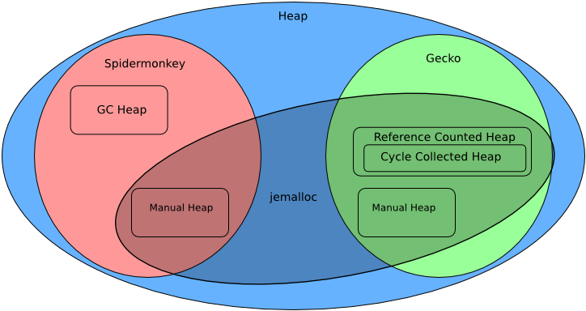

# MemShrink

**카일 휴이 (Kyle Huey)**

## 소개

파이어폭스는 오랫동안 메모리를 매우 많이 사용한다는 비판을 받아왔다. 정도는
차이가 있지만 악평은 계속 웹브라우저를 따라다녔다. 과거 몇년간 파이어폭스
새버전이 나올 때마다 회의적인 사용자들은 "메모리 누출을 고쳤냐?"고 물었다.
여러번 출시일을 연기하며 오랜 베타 기간 끝에 2011년 3월 파이어폭스 4를
공개했을 때도 마찬가지였다. 파이어폭스 4가 공개 동영상 지원, 자바스크립트 성능,
그래픽 가속 등 영역에서 크게 발전했지만, 불행하게도 메모리 사용 측면에서는
상당히 퇴보했다.

최근 브라우저 시장은 매우 경쟁적이다. 모바일 기기가 증가하고 구글 크롬이
출시되고 마이크로소프트가 웹에 다시 투자하는 등 이제 파이어폭스는 사경을 헤매던
인터넷 익스플로러 대신 훌륭하고 자금이 충분한 여러 경쟁자와 다투어야 하는
상황이 되었다. 특히 구글 크롬은 사용자에게 빠르고 가벼운 웹을 선사하며 크게
앞서 나갔다. 더 이상 좋은 브라우저만으로는 충분하지 않다는 아픈 교훈을 배웠다.
우리는 훌륭한 브라우저가 되야 했다. 오랫동안 모질라에 공헌해온 당시 모질라
기술 부책임자 마이크 쉐이버(Mike Shaver)는 "이것이 우리가 원하는 세상이고,
우리가 만든 세상이다."라고 말했다.

이것이 2011년 초 우리의 현실이였다. 파이어폭스의 점유율은 정체 혹은 감소하고
있었고, 구글 크롬은 빠르게 이름을 날렸다. 성능 차이를 좁혀가기 시작했지만,
파이어폭스 4가 메모리 사용량을 늘리는 대가로 자바스크립트와 그래픽 성능 향상에
집중했기 때문에 여전히 메모리 사용량은 큰 차이를 보였다. 파이어폭스 4를
발표한 이후 메모리 사용량을 잡기위해 니콜라스 네더코트(Nicholas Nethercote)의
지도하에 기술자들이 멤슈링크(MemShrink) 프로젝트를 시작했다. 일년 반이 지난
지금 합심한 노력의 결과 파이어폭스 메모리 사용량과 평판이 극적으로 바뀌었다.
"메모리 누출(memory leak)"은 대부분의 사용자의 마음에서 옛것이 되었고,
파이어폭스는 비교 결과 가장 날씬한 브라우저 중 하나가 되었다. 이 장은
파이어폭스 메모리 사용량을 개선하기위한 우리의 노력과 그 과정에서 배운
교훈을 살펴본다.

## 아키텍쳐 개요

우리의 문제와 우리가 찾은 해결책을 이해하려면 우선 파이어폭스가 어떤 일을
어떻게 하는지 개략적으로 알아야 한다.

현대 웹브라우저는 근본적으로 신뢰할 수 없는 코드를 실행하는 가상머쉰이다.
여기서 코드는 제삼자가 제공한 HTML, CSS, 자바스크립트(JS)의 조합니다. 또,
파이어폭스 애드온과 플러그인의 코드도 있다. 가상머쉰은 계산, 레이아웃,
글자 스타일, 그림, 네트워크 접근, 오프라인 저장소는 물론이고 심지어 하드웨어
가속 그래픽 기능도 제공한다. 일부 기능은 해당 작업을 위해 설계된 API를 통해
제공하고, 일부는 완전히 다른 용도로 개조한 API를 통한다. 웹이 진화한 방식
때문에 웹브라우저는 매우 자유로운 입력을 허용해야 하고, 15년 전 브라우저
설계로는 오늘날 빠른 경험을 제공할 수 없다.

파이어폭스는 게코(Gecko) 레이아웃 엔진과 스파이더몽키(Spidermonkey)
자바스크립트 엔진을 탑재한다. 둘은 기본적으로 파이어폭스를 위해 작성되었지만,
분리되었고 독립적으로 사용하는 코드이다. 널리 사용되는 다른 레이아웃 엔진과
자바스크립트 엔진과 마찬가지로 C++로 개발되었다. 스파이더몽키는 가비지 컬렉션과
다양한 just-in-time (JIT) 컴파일을 포함한 자바스크립트 가상머쉰을 구현한다.
게코는 DOM, 소프트웨어 혹은 하드웨어 파이프라인을 사용한 그래픽 렌더링, 페이지와
본문 레이아웃, 완전한 네트워크 스택 등 웹페이지가 사용할 수 있는 대부분의 API를
구현한다. 이 둘을 합쳐서 파이어폭스의 기반을 이룬다. 주소막대와 이동버튼 같은
파이어폭스 사용자 인터페이스는 특별한 권한을 가지고 실행하는 특별한
웹페이지일뿐이다. 이 권한을 가지면 일반 웹페이지가 볼 수 없는 모든 종류의
기능을 접근할 수 있다. 본문이나 일반 웹페이지와 대비되는 이런 특별한 권한을
기본으로 가진 페이지를 **크롬**이라고 (구글 크롬과 무관) 부른다.

우리의 목적상 스파이더몽키와 게코가 어떻게 메모리를 관리하는지가 가장 궁금했다.
우리는 어떻게 할당하고 어떻게 해제하는지 두가지 측면으로 브라우저
메모리를 분류했다. 동적으로 할당한 메모리(**힙**)는 운영체제에서 큰 덩어리로
가져와서 힙 할당자가 요청한 크기로 나눈다. 주된 힙 할당자는, 1) 스파이터몽키가
가비지 컬랙션 메모리(**GC 힙**)에 사용하는 특별한 가비지 컬랙션 힙 할당자와
2) 이외에 목적으로 게코와 스파이더몽키가 사용하는 jemalloc, 두가지이다. 또한
메모리를 해제하는 방법도, 1) 직접 2) 레퍼런스 카운팅을 사용하여
3) 가비지 컬랙션으로, 세가지가 있다.

{:.kd-center-align}

 그림 1 - 파이어폭스의 메모리 관리

스파이더몽키의 GC 힙은 자바스크립트 실행 중에 생성된 객체와 함수 등 대부분을
담는다. GC 힙의 객체는 수명에 대한 내부 구현 정보와 함께 저장한다. 이 힙은
잘 알려진 점진적 마크앤스위프 컬렉터(incremental mark-and-sweep collector)를
성능과 반응성을 높이려고 매우 최적화하여 사용한다. 즉, 주기적으로
가비지 컬렉터가 깨어나서 GC 힙 메모리를 살펴본다. (현재 보고있는 페이지의
전역 객체 같은) "뿌리(roots)" 집합에서 시작하여 도달 가능한 모든 객체를
"표시하고(marks)", 마지막에 표시안된 객체를 모두 "쓸어내고(sweeps)" 필요하면
그 메모리를 재사용한다.

게코는 대부분의 메모리를 레퍼런스 카운팅한다. 레퍼런스 카운팅 방식은 해당
메모리 부분을 가리키는 참조 개수를 추적하다가 숫자가 영이 되면 메모리를
해제한다. 엄밀히 말해서 레퍼런스 카운팅이 가비지 컬렉션의 일종이지만, 여기서는
주기적으로 메모리를 되찾아오는 특별한 코드(즉, **가비지 컬렉터**)가 필요한
가비지 컬렉션 기법과 구분하겠다. 단순한 러퍼런스 카운팅은 메모리 A와 B가 서로를
참조하는 순환 참조를 다루지 못한다. 이 경우 A와 B 모두 참조 개수가 1이기 때문에
메모리가 절대로 해제되지 않는다. 게코에는 이런 순환 참조를 전문적으로 해제하는
우리가 **사이클 컬렉터(cycle collector)**라고 부르는 특별한
트레이싱 가비지 컬렉터(tracing garbage collector)가 있다. 사이클 컬렉터는
미리 순환한다고 알려진 특정 종류만을 선택적으로 관리하기 때문에 사이클 컬렉터가
담당하는 힙도 레퍼런스 카운팅 힙 안에 포함된다고 볼 수 있다. 사이클 컬렉터는
스파이더몽키의 가비지 컬렉터와 마찬가지로 언어간 메모리 관리가 가능하여
C++ 코드가 자바스크립트 객체의 참조를 가질 수 있고 그 반대도 가능하다.

또한 스파이더몽키와 게코에는 직접 수동으로 관리하는 메모리도 많다. 배열과
해시테이블의 내부 메모리에서부터 이미지와 스크립트 소스 자료의 버퍼에 이르기까지
다양하다. 수동으로 관리하는 메모리를 토대로 한 특수 할당자도 있다.
아레나 할당자(arena allocator)가 그 일례다. 서로 다른 수많은 할당을 한번에 모두
해제할 수 있을 때 아레나를 사용한다. 아레나 할당자는 메인 힙 할당자에게 얻은
메모리 조각을 요청받을 때마다 나눠준다. 아레나가 더 이상 필요없어지면, 아레나는
여러 작은 할당을 일일이 해제할 필요없이 메모리 조각 전체를 메인 힙에게 반환한다.
게코는 페이지가 더 이상 필요없어지면 한번에 모두 버려도 되는 페이지 레이아웃
자료에 아레나 할당자를 사용한다. 아레나 할당자를 사용하면 보안 공격에 악용할
수 없도록 할당해제한 메모리를 덮어쓰기하는 **포이즈닝(poisoning)** 같은
보안 기능도 구현할 수 있다.

파이어폭스에는 다양한 용도로 일부분에서 사용하는 여러 수제 메모리 관리 시스템이
있지만, 우리 논의와 무관하다. 파이어폭스 메모리 구조를 짧게 둘러보았으니 이제
우리가 발견한 문제와 그 문제를 어떻게 고쳤는지 살펴보자.

## 측정해야 얻는다

문제를 고치는 첫번째 단계는 문제가 무엇인지 파악하는 것이다. 운영체제에서
메모리를 할당받고 다시 돌려주지 않는, 메모리 누수의 엄밀한 정의는 우리가
개선하려는 모든 상황을 설명하지 않는다. 일부 상황은 엄밀한 의미에서 "누수"가
아니였다.

* 필요한 양보다 두배나 많은 메모리를 요구하는 자료구조.
* 더 이상 사용하지 않지만 일정 시간이 지날 동안 해제안된 메모리.
* 프로그램 곳곳에 존재하는 (문자열, 이미지 자료 등) 동일한 대형 버퍼의 여러
  복사본들.

상황을 더 복잡하는 만드는 사실은 파이어폭스 힙의 메모리 대부분이 어떤
식으로든 가비지 컬렉션과 연관되어 더 이상 메모리를 사용하지 않더라도 다음 번
GC가 실행되기 전까지 해제되지 않는 점이다. 우리는 파이어폭스가 이성적으로
사용할 수준 보다 덜 메모리 효율적인 상황까지 아우르도록 "누수"란 단어의 의미를
매우 넓게 정의했다. 이는 일반 사용자가 이 단어를 사용하는 경우와 일치한다.
대부분의 사용자들은 심지어 웹개발자까지도 메모리 사용량이 놃은 이유가
실제 누수 때문인지 아니면 동작중인 브라우저의 다른 여러 요인 때문인지
구별하지 못한다.

멤슈링크를 시작할 당시 우리는 브라우저가 메모리를 어떻게 사용하는지 잘 이해하지
못했다. 메모리 문제의 성격을 파악하기위해 GDB 같은 저수준 도구나 Massif 같은
복잡한 도구가 필요했다. 이 도구들은 여러 단점이 있다.

* 개발자가 사용하도록 설계되었고 사용하지 쉽지 않다.
* (여러 힙의 구현 방식 등) 파이어폭스 내부를 모른다.
* "항상 실행중"이지 않다. 문제가 발생할 당시 이미 실행하고 있어야 한다.

이 도구들은 매우 강력하지만 이런 단점이 있다. 시간이 지나면서 이런 단점을
해소하기위해 우리는 적은 노력으로 브라우저 행동을 이해할 수 있는 도구를 직접
만들었다.

첫번째 도구가 `about:memory`이다. 파이어폭스 3.6에 처음 등장했을 때는 매핑되고
커밋된 메모리 크기 같은 힙에 대한 간단한 통계를 보여주었다. 나중에 내장 SQLite
데이터베이스 엔진과 그래픽 가속 하위시스템이 사용하는 메모리 등 일부 개발자가
관심을 가지는 측정값이 추가되었다. 우리는 이 측정값을 **메모리 리포터**라고
부른다. 이런 일회성 추가 외에 `about:memory`는 메모리 사용량에 대한 요약 통계를
보여주는 기본적인 도구로 남아있었다. 대부분의 메모리를 위한 메모리 리포터가
없었기 때문에 `about:memory`에 보이지 않았다. 그렇다고 해도 `about:memory`는
특별한 도구나 파이어폭스 개발버전 없이도 브라우저 주소줄에 입력하기만 하면
누구나 사용할 수 있다. 이것이 "핵심 장점"이 된다.

멤슈링크를 시작하기 전에, 하나의 큰 전역 GC 힙을 컴파트먼트(compartment)라는
작은 하위힙의 모음으로 쪼개도록 파이어폭스의 자바스크립트 엔진을 수정했다.
컴파트먼트는 크롬과 본문 (각각 특별한 권한이 있는 코드와 없는 코드) 사이는
물론이고 웹사이트마다 메모리를 구분한다. 보안이 가장 주된 이유였지만,
멤슈링크에게도 매우 유용한 변화였다. 컴파트먼트를 구현하자마자 우리는 모든
컴파트먼트가 각각 메모리를 얼마나 어떻게 사용하는지 보여주는
`about:compartments`란 도구를 시범삼아 만들었다. `about:compartments` 기능은
파이어폭스에 직접 들어가지 않았지만, 멤슈링크가 시작한 이후 수정되어
`about:memory`에 포함되었다.

컴파트먼트 정보를 `about:memory`에 추가하면서 다른 할당에 대해서도 비슷하게
보여준다면 Massif 같은 특수한 도구 없이도 힙 프로파일링이 가능함을 깨달았다.
그래서 일련의 요약 통계 대신 메모리 사용량을 수많은 용도로 구분한 트리로
보여주도록 `about:memory`를 변경했다. 그래고 레이아웃 하위시스템 같이 힙을 많이
할당하는 다른 종류의 메모리를 위한 리포터를 더하기 시작했다. 초창기 지표 주도
노력 중 하나는, 메모리 리포터가 담당하지 않는,
**미분류 힙(heap-unclassified)**의 크기를 줄이는 것이었다. 우리는 일상적인
경우 미분류 힙의 목표치로 별 생각없이 10%를 잡았다. 결국 10%는 너무 낮은 목표로
판명되었다. 브라우저는 일회성 할당을 상당히 많이 하기 때문에 미분류 힙을
약 15% 이하로 유지할지 없다. 미분류 힙 크기를 줄이는 과정에서 브라우저가
어떻게 메모리를 사용하는지 더 깊게 이해하게 되었다.

미분류 힙 크기를 줄이기위해 보고안된 힙 할당 추적을 도와주는
암흑물질검출기(Dark Matter Detector, DMD)라는 도구를 만들었다. 이 도구는
힙 할당기를 대체하여 직접 `about:memory`에 할당 블록 정보를 집어는 방식으로
동작한다. 호출 위치별로 보고안된 메모리 할당을 취합하여 알려준다. 파이어폭스와
함께 DMD를 실행하면 미분류 힙을 만드는 호출 위치 목록을 만든다. 어디에서
할당했는지 일단 파악되면, 개발자가 관련된 구성요소를 찾아서 메모리 리포터를
금세 추가했다. 몇 달만에 "브라우저에서 페이스북 페이지들이 250 MB 메모리를
사용하며 자세한 내역을 이렇습니다"라고 알려주는 도구가 생겼다.

메모리 문제를 파악한 이후 디버깅을 위해 (**Measure and Save**라는) 다른 도구도
개발했다. 이 도구는 자바스크립트 힙과 사이클 컬렉션된 C++ 힙 정보를 파일에
기록한다. 그리고 통합 힙을 따라가며 "무엇이 이 객체를 버리지 못하도록 잡고있지?"
같은 질문에 답해주는 여러 분석 스크립트를 작성했다. 그래서 연결되지 않아야 할
힙 그래프 연결고리를 살펴보는 것부터 디버거를 실행하여 관심있는 개체에 중단점을
설정하는 것까지 다양한 디버깅 기법이 가능해졌다.

이들 도구는 Massif 같은 도구와 달리 문제가 발생한 이후에 실행할 수 있는 장점이
있다. (Massif를 포함하여) 많은 힙 프로파일러는 웹브라우저를 시작할 때 같이
시작해야 한다. 도중에 문제가 나타난 이후에 시작할 수 없다. 다른 장점은 직접
내 자리에서 문제를 재현하지 않고도 정보를 분석할 수 있다. 그래서 개발자가
문제를 재현하지 못하더라도 사용자가 문제를 발견하면 정보를 캡쳐하여 개발자에게
보낼 수 있다. 버그 관리 페이지에 버그를 보고할 정도로 수준이 높은 웹브라우저
사용자라 할지라도 브라우저에 GDB나 Massif를 사용하기를 기대할 수는 없다.
그러나 버그 보고에 더할 자료를 얻기 위해 `about:memory`를 띄우거나 작은
자바스크립트 코드를 실행하는 것은 훨씬 쉽다. 범용 힙 프로파일러는 수많은
정보를 알려주지만 비용도 만만하지 않다. 우리는 범용 도구에 비해 큰 이득을
안겨 줄 맞춤 도구들을 만들 수 있었다.

항상 직접 도구를 만들 필요는 없다. 우리는 소프트웨어를 개발할 때마다 새로
디버거를 작성하지 않고 GDB를 사용한다. 그러나 기존의 도구가 원하는 정보를
원하는 방식으로 알려주지 못하는 상황이라면 직접 만든 도구가 큰 이득이 되었다.
완전하다고 생각하는 단계까지 가기위해 일년간 틈틈이 `about:memory` 작업을 했다.
심지어 요즘도 우리는 필요한 경우 새로운 기능과 리포터를 추가하고 있다. 도구를
직접 만드는 것은 상당한 투자이다. 이 글의 범위를 넘어서기 때문에 이 주제를 더
늘어놓을 수 없지만, 도구를 직접 만들기 전에 이익과 비용을 신중히 고려해야 한다.

## 쉽게 달성한 성과

우리가 만든 도구는 브라우저의 메모리 사용에 대해 전보다 훨씬 명확하게
알려주었다. 한동안 사용해보고 무엇이 정상인지 무엇이 비정상인지 감을 잡기
시작했다. 버그일 가능성이 있는 비정상인 위치를 잡아내기 매우 쉬워졌다.
미분류 힙의 큰 부분은 아직 메모리 리포터를 추가하지 않은 불가사의한 웹 기능
혹은 게코 내부의 누수 때문이였다. 자바스크립트 엔진에서 이상한 부분이 메모리를
많이 사용하는 것은 코드가 최적화가 안되었거나 문제가 있는 코드를 실행하고
있다는 의미일 수 있다. 이런 정보를 사용하여 파이어폭스의 가장 심각한 버그를
찾고 고칠 수 있었다.

종종 이미 닫은 페이지의 컴파트먼트가 심지어 가비지 컬렉터가 여러번 실행된
이후에도 남아있는 이상한 현상을 초기에 발견했다. 일부는 결국 알아서 사라졌지만
일부는 영원히 남아있었다. 우리는 이런 누수를 **좀비 컴파트먼트**라고 불렀다.
웹페이지가 사용하는 메모리가 무한대로 증가할 수 있기 때문에 가장 심각한 누수
중 하나였다. 게코와 파이어폭스 UI 코드에 있는 이런 버그를 많이 고쳤지만,
곧 좀비 컴파트먼트를 만드는 주범이 애드온임이 밝혀졌다. 애드온 누수 문제는
나중에 설명할 해결책을 찾기 전까지 여러달 동안 우리를 괴롭혔다. 파이어폭스이건
애드온이건 간에 대부분의 좀비 컴파트먼트는 수명이 긴 자바스크립트 객체가
수명이 짧은 자바스크립트 객체의 참조를 가지고 있어서 발생한다. 수명이 긴
자바스크립트 객체는 보통 브라우저 창이나 전역 싱글톤에 붙어있지만, 수명이
짧은 자바스크립트 객체는 보통 웹페이지 안의 객체이다.

DOM과 자바스크립트가 동작하는 방식 때문에 웹페이지가 한 객체를 참조하면 전체
페이지와 그 전역 객체(그리고 여기서 참조를 반복하여 도달할 수 있는 모두)를
해제할 수 없다. 그래서 수 메가바이트를 차지하는 경우는 흔하다. 가비지 컬렉터
방식의 성격상 가비지 컬렉터는 프로그램이 실제로 객체를 사용하지 않을 때가
아니라 참조를 따라 도달할 수 없을 때 메모리를 해제한다. 다시 사용하지 않는
메모리를 도달할 수 없게 만드는 일은 프로그래머의 몫이다. 객체의 모든 참조를
제거하지 않으면, 참조하는 자와 참조하는 대상의 수명이 크게 다른 경우 결과가
훨씬 더 심각해진다. (특정 웹페이지가 사용하는 메모리 같이) 상대적으로 빨리
해제해야 할 메모리가 더 오래 사는 (브라우저 창이나 애플리케이션 같은) 참조자의
수명에 묶이게 된다.

비슷한 이유로 자바스크립트 힙의 파편화도 우리에게 문제였다. 수많은 웹페이지를
닫아도 운영체제가 보고하는 파이어폭스 메모리 사용량이 크게 감소하지 않는
현상을 자주 목격했다. 자바스크립트 엔진은 운영체제에서 메가바이트 단위로
메모리 덩어리를 할당받아 필요한 여러 컴파트먼트에게 나눈다. 이 덩어리를
완전히 사용하지 않을 때만 다시 운영체제에게 돌려줄 수 있다. 살펴보니
웹콘텐츠가 메모리를 더 요구하면 거의 항상 새로운 덩어리를 할당하지만,
크롬 컴파트먼트 때문에 덩어리를 해제하지 못하는 경우가 많았다. 수명이
짧은 객체들로 가득한 덩어리에 수명이 긴 객체 몇개를 섞으니 웹페이지를 닫아도
덩어리를 해제할 수 없다. 크롬 컴파트먼트와 콘텐츠 컴파트먼트를 분리하고
덩어리가 각각 크롬과 콘텐츠 할당만을 담게 하여 이 문제를 해결했다. 탭을 닫을 때
운영체제에게 반환할 수 있는 메모리 양이 크게 증가했다.

파편화를 줄이려는 해결책 때문에 발생한 다른 문제를 발견하기도 했다. 파이어폭스의
기본 힙 할당자는 윈도우즈와 Mac OS X에서 동작하도록 수정한 jemalloc이다.
Jemalloc은 파편화 때문에 발생하는 메모리 손실을 줄이도록 설계되었다. 그 방법
중 하나는 연속한 메모리 덩어리에서 메모리를 할당할 때 메모리 크기를
다양한 크기 종류로 올림하여 할당하는 것이다. 그러면 나중에 비슷한 크기를
할당할 때 반환한 공간을 재사용할 수 있다. 그러나 올림 때문에 일부 공간을
낭비하게 된다. 우리는 이렇게 낭비하는 공간을 **슬랍(slop)**이라고 부른다.
최악의 경우 할당한 공간의 거의 50% 정도를 낭비할 수 있다. Jemalloc이
크기 종류를 구성한 방식상 2의 거듭제곱 바로 다음 숫자의 경우 (예, 17은 32로
올림, 1025는 2048로 올림) 항상 절반을 낭비한다.

보통은 메모리를 할당할 때 특별하게 크기를 요구하지 않는다. 클래스의
새로운 인스턴스를 할당할 때 바이트를 더 추가해서 유용한 경우는 거의 없다.
어느정도 융통성이 있는 경우는 있다. 문자열 공간을 할당할 때 나중에 문자열 뒤에
덧붙일 경우 재할당하지 않고 추가 공간을 사용할 수 있다. 이런 기회가 예상된다면
(직접 올림하여) 정확히 크기 종류에 해당하는 공간을 요청할 수 있다. 이렇게
슬랍으로 "낭비되었던" 메모리를 추가 비용없이 사용할 수 있다. 현존하는
모든 할당자와 잘 맞고 할당자에 대해 특별히 몰라도 되기 때문에 코드는
항상 2의 거듭제곱을 요청하도록 작성했다.

이런 기법을 사용한 코드를 게코에서 많이 찾았고, 일부는 잘못 사용한 경우였다.
멋지게 올림한 메모리를 할당하려고 시도했지만, 숫자를 조금 잘못 계산하여 의도한
것보다 하나 많게 할당한 코드가 여러 곳이였다. 그러면 Jemalloc의 크기 종류
구성상 (한번 더 올림하여) 할당한 공간의 거의 50%를 슬랍으로 낭비하게 된다.
터무니없는 예를 하나 들면 레이아웃 자료구조를 위한 아레나 할당자 구현이 있다.
아레나는 힙에서 4KB를 할당하려고 시도했다. 또, 기록관리 목적으로 워드를 몇개
추가하여 결국 4KB 보다 조금 많은 요청이 8 KB로 올림되었다. 이 실수를 바로잡으니
GMail에서만 3 MB 이상 슬랍을 절약했다. 특별히 구성한 레이아웃 테스트에서는
700 MB 이상 슬랍을 절약하여 브라우저 전체 메모리 사용량이 2 GB에서 1.3 GB로
떨어졌다.

SQLite에서도 비슷한 문제를 찾았다. 게코는 방문기록과 즐겨찾기 등을 저장할
데이터베이스 엔진으로 SQLite를 사용한다. SQLite는 내장 애플리케이션이
메모리 할당을 직접 할 수 있도록 작성되었고, 자신의 메모리 사용량을 매우
꼼꼼히 측정한다. 측정 결과를 유지하기위해 워드 두개를 추가하니 할당이 다음
크기 종류로 넘어갔다. 아이러니하게도 메모리 사용량을 추적하기위한 행동이
사용량을 두배로 늘리는 동시에 실제보다 상당히 적게 메모리를 사용한다고 보고하게
되었다. 광대의 신발처럼 우스꽝스럽게 나쁘고 매우 많은 빈공간을 낭비하기
때문에 이런 종류의 버그를 "광대신발(clownshoes)"이라고 부른다.

## 당신의 잘못이 아니라고 해서 당신의 문제가 아닌 건 아니다

여러달 동안 우리는 파이어폭스 메모리 사용량을 개선하고 누수를 고치는 대장정을
했다. 그러나 사용자 모두가 이 작업의 혜택을 본 것은 아니다. 사용자가 경험하는
메모리 문제의 상당수는 애도온 때문임이 명확해졌다. 우리 기록에 따르면 누수를
일으키는 애드온 버그 보고가 100건을 넘어섰다.

그동안 모질라는 애드온과 함께 걸어오려고 노력했다. 우리는 파이어폭스를 풍부한
애드온을 가진 확장가능한 브라우저로 광고했다. 그러나 사용자가 애드온과 연관된
성능 문제를 보고하면 우리는 그 애드온을 사용하지 말라고 이야기할 뿐이였다.
메모리 누수를 일으키는 애드온의 숫자를 보면 이런 대응이 더 이상 불가능했다.
많은 파이어폭스 애드온은 모질라의 `addons.mozilla.org` (AMO)를 통해 배포된다.
AMO는 애드온의 일반적인 문제를 잡기위한 리뷰 정책이 있다. AMO 리뷰자들이
`about:memory` 같은 도구를 사용하여 애드온의 메모리 누수를 검사하기 시작하면서
우리는 문제가 얼마나 방대한지 알게 되었다. 애드온 개발자에게 연락해서 모범
사례와 누수가 생기는 흔한 실수 목록을 전달했다. 불행히도 성공한 경우는
적었다. 일부 애드온은 개발자가 바로잡았지만, 대부분은 그러지 못했다.

이 방식이 비효율적인 이유는 다양하다. 모든 애드온이 정기적으로 갱신되지 않는다.
애드온 개발자는 자원해서 개발했고 자신의 일정과 우선순위가 있다. 메모리
누수를 특히 바로 자기 자리에서 재현할 수 없는 경우 디버깅하기 힘들다.
앞에서 다룬 힙 덤프 도구가 매우 강력하고 정보를 쉽게 수집할 수 있지만,
결과를 분석하기는 여전히 복잡하고 애드온 개발자에게 기대하기 너무 과한 일이다.
마지막으로 누수를 고치도록 유도하는 강한 동기부여가 없다. 나쁜 소프트웨어를
내놓고 싶은 사람은 없지만, 항상 모든 것을 고칠 수는 없다. 또한 사람들은
**우리가** 그들에게 바라는 것보다는 **자신이** 원하는 것을 하는데 더 관심이
있다.

우리는 누수를 고치도록 장려하는 제도를 만들려고 오랫동안 논의했다. 애드온은
모질라에 다른 성능 문제도 초래하고 있었다. 그래서 우리는 AMO나 파이어폭스
자체에 애드온 성능 자료를 보여주도록 이야기했다. 사용자가 어떤 애드온을
사용할지 결정하는데 도움을 주기위해 이미 설치했거나 설치할 애드온의 성능 영향을
알려주는 것이다. 이 방안의 첫번째 문제는 웹브라우저 소비자가 트레이드오프
결정을 내리지 못한다. 4억명 파이어폭스 사용자 중 몇명이 메모리 누수가 무엇이고
그럼에도 불구하고 아무개 애드온을 사용할 가치가 있는지 평가할 수 있겠는가?
두번째로 애드온 성능 영향을 이렇게 처리하려면 모질라 공동체의 다른 여러
구성원들의 동의가 필요하다. 예를 들어 애드온 개발 공동체를 이루는 사람들은
애드온을 추방망치로 부수는 생각에 환호하지 않는다. 마지막으로 많은 파이어폭스
애드온이 AMO을 전혀 거치지 않고 다른 소프트웨어에 번들로 설치되기도 한다.
우리는 이런 애드온에 대해 차단과 같은 영향력이 거의 없다. 이런 이유로
장려책을 만들려는 시도를 포기했다.

애드온이 누수를 고치도록 장려하는 안을 포기한 다른 이유는 문제를 해결하는 전혀
다른 방법을 찾았기 때문이다. 우리는 결국 누수가 있는 애드온을 사용한 후
파이어폭스를 "정화할" 방법을 찾기위해 노력했다. 한동안 우리는 수많은 애드온을
동작하지 못하게 하지 않고서는 불가능하다고 생각했지만, 어쨌든
계속 실험했다. 결국 대부분의 애드온에 악영향을 주지 않고 메모리를 해제하는
기술을 구현할 수 있었다. 우리는 컴파트먼트 사이에 경계를 만들어서 페이지를
이동하거나 탭을 닫을 때 크롬 컴파트먼트에서 콘텐츠 컴파트먼트로 가는 참조를
"끊었다". 그러면 크롬 컴파트먼트에는 더 이상 아무도 참조하지 않는 객체가
남게 된다. 처음에는 코드가 나중에 그 객체를 사용하려 할 때 문제가 된다고
생각했지만, 대부분의 경우 이 객체는 나중에 사용되지 않았다. 사실 애드온은
웹페이지의 객체를 실수로 혹은 아무 의미없이 캐시하였고, 애드온을 사용한 이후에
자동으로 청소해도 문제가 거의 없었다. 결국 기술적인 문제에 사회적인 해결책을
찾고 있었던 것이다.

## 탁월하려면 끝없는 고집이 필요하다

멤슈링크 프로젝트는 파이어폭스 메모리 문제에 상당한 진전을 가져왔지만, 아직도
할 일이 많이 남아있다. 쉬운 문제는 현재 대부분 고쳤다. 남은 것은 상당한
공학적 노력이 필요하다. 우리는 힙을 합칠 수 있는 이동 가비지 컬렉터(moving
garbage collector)를 가지고 자바스크립트 힙 파편화를 계속 줄일 계획이다.
우리는 이미지를 처리하는 방식을 더 메모리 효율적으로 개선하고 있다. 이미 완료한
여러 변화와 달리 복잡한 하위시스템의 구조를 완전히 뜯어고쳐야 한다.

마찬가지로 중요한 점은 아직 우리가 만든 개선을 테스트하지 못했다. 2006년 이후
모질라는 회귀테스트를 강화했다. 파이어폭스 메모리 사용량을 줄인 성과를 거두었기
때문에 메모리 사용량을 회귀테스트하는 시스템을 가지고 싶어졌다. 성능은 기능보다
테스트하기 힘들다. 이런 시스템을 만들 때 가장 힘든 부분은 현실적인 브라우저
작업량을 찾는 것이다. 기존의 브라우저 메모리 테스트는 완전히 현실과 담을
쌓았다. 예를 들어, MemBuster는 여러 위키와 블로그를 빠르게 연속해서 매번
새창으로 연다. 요즘 대부분의 사용자는 새창 대신 탭을 사용하며 웹페이지는
위키나 블로그 보다 복잡해졌다. 모든 페이지를 동일한 탭에 여는 다른 벤치마크도
요즘 웹브라우저 현실과 맞지 않는다. 우리는 우리가 생각하기에 상당히 현실적인
작업량을 고안했다. 페이지를 읽는 사용자를 흉내내기위해 사이에 시간을 두면서
고정된 30개 탭에 페이지 100개를 여는 것이다. 페이지는 모질라의 기존 **Tp5**
페이지묶음을 사용한다. Tp5는 알렉사(Alexa) 순위 상위 100개 사이트의 페이지들로,
기존 성능 테스트가 페이지를 읽는 성능을 테스트할 때 사용해왔다.
우리 테스트 목적에 유용하다고 판명된 자료였다.

또, 테스트를 하려면 무엇을 측정할지 파악해야 한다. 우리의 테스트 시스템은
페이지 열기 전과 페이지를 모두 연 이후 그리고 탭을 모두 닫은 이후 이렇게
세번 메모리 사용량을 측정했다. 측정은 30초간 아무 행동을 하지 않고
가비지 컬렉터를 강제로 실행한 후에 진행했다. 측정 결과를 보고 우리가 과거에
경험한 문제가 재발했는지 확인한다. 예를 들어, 30초가 지난 후 측정값과
강제 가지비 컬렉션 이후 측정값이 크게 차이가 나면 우리의 가비지 컬렉션
휴리스틱이 지나치게 보수적이란 뜻일 수 있다. 아무 것도 열기 전 측정값과
탭을 모두 닫은 후 측정값이 크게 차이가 나면 메모리 누수를 의심할 수 있다.
우리는 측정할 때마다 상주 집합 크기(resident set size), "명시적인" 크기
(`malloc()`과 `mmap()` 등으로 요청한 메모리량), 미분류 힙과 같은
`about:memory` 항목별 메모리 크기 등 여러 수치를 기록한다.

이 시스템을 모두 갖추고 우리는 최신 파이어폭스 개발 버전에 정기적으로
돌려본다. 또, 대략 파이어폭스 4까지 이전 버전도 돌려본다.
그래서 풍부한 과거 자료와 일종의 지속적인 통합을 하게 된다.
메모리 테스트 시스템이 수집한 모든 정보를 `areweslimyet.com`으로 공개하였다.
`areweslimyet.com`을 만들어서 브라우저의 각 부분을 개발하다 생긴
회귀를 여러번 발견했다.

## 공동체

멤슈링크 노력이 성공하게 된 결정적인 요인은 폭넓은 모질라 공동체의 지원
덕분이다. 요즘은 파이어폭스를 개발하는 대부분의 (확실히 전부는 아님) 기술자가
모질라 소속이지만, 모질라에 자원한 활발한 공동체는 테스트, 지역화, QA,
마케팅 등에 기여했다. 이런 지원 없이는 모질라 프로젝트가 중단되었을 것이다.
우리는 의도적으로 공동체 지원을 받기위한 방식으로 멤슈링크 프로젝트를 구성했고,
상당한 성과가 있었다. 멤슈링크 핵심 개발팀은 급여를 받는 기술자 몇명으로
구성되지만, 버그 보고, 테스트, 애드온 수정을 통한 공동체 지원은 우리의 노력을
배가했다.

심지어 모질라 공동체 안에서도 메모리 사용량은 오랫동안 불만이였다. 일부는
직접 문제를 경험했고, 다른 사람은 문제를 경험한 친구나 가족을 두었다.
문제를 만나지 못한 운 좋은 분들도 파이어폭스 메모리 사용량을 불평하면서
새 버전이 나올 때마다 "누수가 고쳐졌냐고?" 덧글을 달았다. 자신의 고생이,
특히 자신이 건드리지 않은 것에 대해, 비난당하는 것을 즐기는 사람은 없다.
공동체 대부분이 말하는 오랜 문제를 해결하는 것이 지원을 얻는 훌륭한
첫걸음이였다.

단지 우리가 문제를 해결하고 있다고 말하는 것으로는 충분하지 않았다. 우리는
진지하게 고치하고 있고 실제 진척이 있음을 보여주어야 했다. 우리는
공개적으로 매주 회의를 하여 버그의 우선순위를 정하고 작업 중인 프로젝트를
논의했다. 니콜라스는 회의 때마다 진행 상황을 블로그에 올려서 회의에 참석하지
않은 사람들에게 무슨 일이 있었는지 알렸다. 어떤 점을 개선했고 버그 개수가
어떻게 변했고 어떤 새로운 버그가 보고되었는지는 멤슈링크에 대한 우리의 노력을
보여준다. 그리고 쉽게 해결할 수 있는 문제를 먼저 개선하여 우리가 문제를
해결하는데 도움이 되었다.

마지막으로 넓은 공통체와 멤슈링크 개발자들 사이에 의견교환이 필요하다.
앞에서 소개한 도구들은 전에는 재현불가로 판정되거나 잊혀졌던 버그를 고칠 수
있게 만들었다. 또, 우리는 진척 보고 블로그에 달린 불평과 덧글과 응답을
버그 보고로 바꾸고, 문제를 해결하기위해 필요한 정보를 수집하려고 했다.
모든 버그 보고를 경중에 따라 우선순위를 매겼다. 또, 사소해서 고칠 필요가
없더라도 모든 버그 보고를 조사하려고 노력했다. 조사를 통해 보고자는 자신의
노력을 가치있다고 생각하게 되고, 다른 사람이 나중에 여유가 될 때 고칠 수
있도록 버그를 보고하려고 했다. 이런 행동을 통해 훌륭하게 버그를 보고하고
귀중한 테스트를 도와주는 강력한 공동체 지원 기반을 갖추었다.

## 결론

멤슈링크 프로젝트를 진행한 2년 동안 우리는 파이어폭스 메모리 사용량을 크게
개선했다. 멤슈링크 팀은 가장 흔한 사용자 불만사항 중 하나였던 메모리 사용량을
브라우저를 홍보하는 강점으로 탈바꿈하고, 파이어폭스 사용자 경험을 크게 향상했다.

우리는 멤슈링크를 개발한 저스틴 레바(Justin Lebar), 앤드루 매크라이트
(Andrew McCreight), 존 쉐넥 (John Schoenick), 쟈니 스텐백 (Johnny Stenback),
제트 빌레가스 (Jet Villegas), 티모시 니켈 (Timothy Nikkel)과 메모리 문제를
수정하도록 도와준 다른 기술자들에게 감사를 전하고 싶다. 그 중에서도 멤슈링크를
시작하고 스파이더몽키 메모리 사용량 감소를 위해 애쓰고 2년간 프로젝트를
운영하는 등 셀 수 없이 수많은 수고를 한 니콜라스 네더코트에게 감사한다.
이 글을 검토한 제트와 앤드루에게도 감사하고 싶다.

